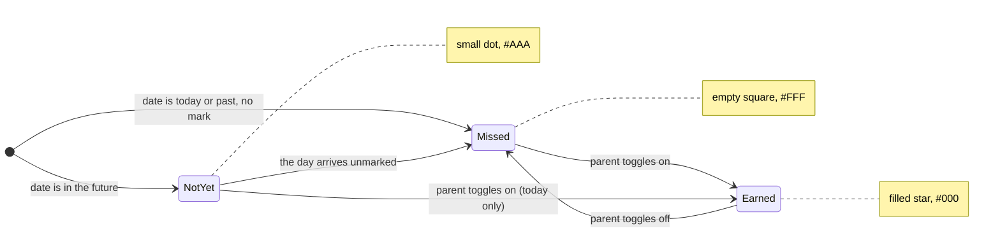
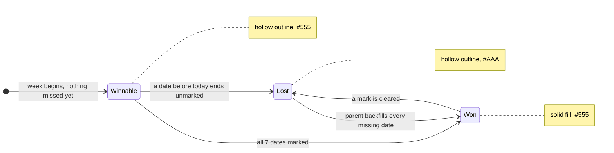
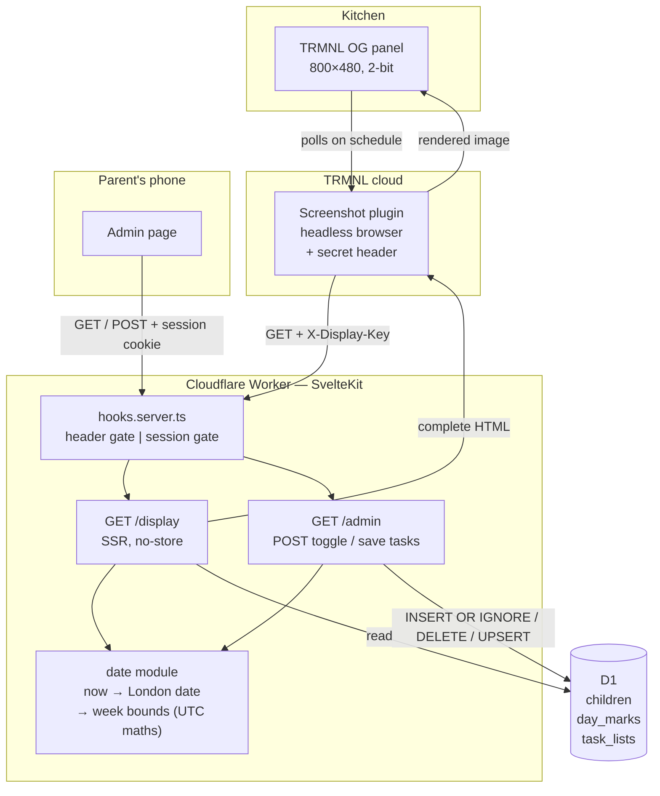

## Context

Greenfield build — see `proposal.md` for motivation. The design is shaped almost entirely by one unusual client: a TRMNL OG e-ink panel that fetches the display page through TRMNL's hosted Screenshot plugin.

That imposes constraints a normal web app does not have:

- **The client is a camera, not a browser.** It loads the page once, screenshots it, and throws it away. Anything that renders after the screenshot fires does not exist.
- **The canvas is fixed and small.** 800×480 physical pixels on a 7.5" panel, so roughly **0.2 mm per pixel**.
- **Four grey levels, no colour.** 2-bit greyscale.
- **Latency is invisible but timeouts are fatal.** Refresh happens on TRMNL's schedule, so a change appearing a few minutes late is fine, but a cold start that stalls the screenshot means a blank wall.
- **The device cannot log in.** No interactive auth is possible on that route.

Everything else — two users, three tables, a few hundred rows a year — is trivially small.

See `specs/` for the behaviour being implemented.

## Goals / Non-Goals

**Goals:**

- A display page that is correct the instant its HTML finishes loading, with zero client-side dependency.
- Date handling that is provably correct across British Summer Time transitions and around midnight.
- An admin page that works from a phone with one thumb, standing in the kitchen.
- Small enough to still be maintainable after a year of not touching it.

**Non-Goals:**

- Sub-minute freshness on the display. TRMNL's polling interval sets the floor and that is fine.
- Any shared UI framework or component library between the two pages. They have almost nothing in common and forcing reuse would compromise the display page.
- Offline support, real-time updates, or multi-household support.

## Decisions

### D1. Absence is the "not earned" state

`day_marks` stores one row per earned day. There is no boolean column and no row for a day that was not earned.

```sql
CREATE TABLE children (
  id         TEXT PRIMARY KEY,
  name       TEXT NOT NULL,
  sort_order INTEGER NOT NULL
);

CREATE TABLE day_marks (
  child_id TEXT NOT NULL REFERENCES children(id),
  date     TEXT NOT NULL,          -- 'YYYY-MM-DD', always a London calendar date
  PRIMARY KEY (child_id, date)
);

CREATE TABLE task_lists (
  child_id   TEXT PRIMARY KEY REFERENCES children(id),
  body       TEXT NOT NULL DEFAULT '',
  updated_at TEXT NOT NULL
);
```

_Why:_ it makes "marking is idempotent" and "clearing leaves no residue" fall out of `INSERT OR IGNORE` and `DELETE`, with no update path and no tri-state to reason about. Trophy status is then a `COUNT(*) = 7` over a week's dates.

_Alternative considered:_ a `earned BOOLEAN` column. Rejected — it introduces a third state (row exists, earned = false) that means nothing to this system and would need to be handled everywhere.

_Alternative considered:_ storing trophies as their own records. Rejected — the spec requires that editing a day mark immediately changes trophy status, so deriving it is both simpler and correct by construction.

### D2. UTC everywhere; exactly one function knows about London

**Project rule: all date and time handling is UTC.** Anything stored, transported, logged, or computed is UTC. No local times, no offsets, no naive timestamps anywhere in the system.

```
storage      day_marks.date         'YYYY-MM-DD'  (plain calendar date, no zone)
             task_lists.updated_at  ISO-8601 UTC, e.g. '2026-08-01T21:14:07Z'
arithmetic   Date.UTC(y, m, d) + n × 86_400_000
transport    UTC only; the client never sends a local time
```

Week boundaries and day offsets are computed by parsing a date string into `Date.UTC(...)` and adding whole multiples of 86,400,000 ms. UTC has no DST, so "seven days after Monday" is always exactly seven days — never 23 or 25 hours.

There is **one** deliberate exception, isolated to a single conversion:

```ts
// The only timezone-aware code in the system.
londonParts(now: Date): { date: string; time: string }   // → '2026-08-02', '20:14'

londonToday(now: Date): string                           // thin wrapper, returns .date
```

`date` answers "which calendar date is it for this family right now", because the chart is on a wall in a UK kitchen and its day must end when theirs does. During BST, London midnight is 23:00 UTC the previous day, so without this the app would disagree with the wall clock for the hour after midnight, seven months of the year.

`time` exists for exactly one consumer: the render stamp on the display (D10). A clock time on a kitchen wall has to be London time — rendering it in UTC would be an hour wrong for seven months of the year, and annotating it as UTC would be noise on a family chart.

_Why one function returning both, rather than two functions:_ a second timezone-aware function would mean `Europe/London` appears twice, and the lint rule in tasks 2.5 would have to relax from "exactly one place" to "one module" — which then loosens again the next time something needs the zone. Deriving both values from a single `Intl.DateTimeFormat` call with `formatToParts` keeps the count at one and keeps the rule enforceable as written.

_Why isolate rather than spread:_ every other function takes a `YYYY-MM-DD` string and is therefore trivially testable with no clock, no zone, and no mocking. The timezone question is asked once, at the edge, and never again.

_Constraint for implementers:_ `londonParts` is the only place `Europe/London` may appear. Any other use of a named timezone, or of a local-time API such as `getDate()`, `getDay()`, or `getHours()`, is a defect — including inside `londonParts` itself, which reads its values from `formatToParts` rather than from any local-time accessor.

_Consequence for the ICU check:_ the workerd test (D9) should assert the clock time as well as the date. A wrong BST offset shifts the time by a full hour but only shifts the date for one hour in twenty-four, so the time is the more sensitive assertion. The hand-rolled fallback still covers both: once the offset is known to be 0 or +1, date and time both follow from UTC arithmetic.

_Risk:_ this relies on Workers having full ICU data for named timezones. Verify early (see Risks).

### D3. Server-rendered with SvelteKit form actions; JavaScript is an enhancement

Both routes are server-rendered. Admin mutations are SvelteKit **form actions**, so toggling a square is a real form POST that works with JavaScript disabled. `use:enhance` layers on optimistic toggling so it feels instant on a phone, reverting the square and surfacing an error if the POST fails.

_Why:_ the display page has a hard requirement to be complete at load, which rules out client-side data fetching. Using the same server-first shape on admin means one mental model, and the failure-visibility requirement is satisfied by the framework rather than by hand-rolled state.

_Alternative considered:_ a JSON API with client-side rendering on admin. Rejected — more moving parts for two users and one screen, and it would make the two pages diverge structurally for no benefit.

### D4. Two independent gates in `hooks.server.ts`

| Route      | Gate               | Mechanism                                                          |
| ---------- | ------------------ | ------------------------------------------------------------------ |
| `/display` | Secret HTTP header | Constant-time compare against a configured secret                  |
| `/admin/*` | Shared password    | Signed, `HttpOnly` + `Secure` + `SameSite=Lax` cookie, long expiry |

Both secrets come from Worker environment bindings and the app fails closed if either is absent.

**The gates are asymmetric, and the asymmetry is deliberate.** An admin session opens `/display` as well as `/admin`; the display header opens only `/display`.

```
   admin session  ──▶  /admin     ✓
                  ──▶  /display   ✓   adds nothing — see below
   display key    ──▶  /display   ✓
                  ──▶  /admin     ✗   must never open
```

_Why the session is allowed through:_ the display page is a read-only rendering of data the session already grants full read and write access to. Refusing it protects nothing, and it costs something real — a parent cannot check what the wall actually looks like without physically walking to the panel, which makes the layout impossible to preview from a phone. The page carries no viewport meta of its own (D6), so a phone scales the fixed 800×480 canvas down to fit, which is exactly the preview wanted.

_Why the reverse must stay shut:_ the display key is configured into a third party's plugin and transmitted on every poll. It is the most widely-exposed credential in the system, and it may never amount to more than "may read the chart". If it ever opened `/admin`, a value sitting in a SaaS dashboard would be a way to edit the chart.

_Superseded:_ this originally read "the gates do not overlap", and was implemented and tested that way. The rule turned out to be stronger than the threat required in one direction, at a real usability cost, and was relaxed only in the direction that grants no new capability.

_Why signed rather than random-token-in-a-table:_ no session table to store, expire, or clean up. The cookie carries an issued-at timestamp and an HMAC over it; verification is a signature check plus an expiry comparison.

_Alternative considered:_ Cloudflare Access in front of `/admin`. Genuinely tempting given Cloudflare is already in use, and it would remove password handling entirely. Rejected for now because it adds an identity-provider dependency to a two-person family app, but it is the obvious upgrade path if the shared password becomes annoying.

### D5. Everything on the display page is inline and self-hosted

The star and trophy are inline SVG. The typeface is a bundled `woff2` served by the app itself. No external requests of any kind.

_Why:_ the Screenshot plugin captures whatever is on screen when it fires. Any resource fetched from a third party is a race the screenshot can lose, and losing it means a fallback font or a missing glyph on the kitchen wall until the next refresh.

The display response also sets `Cache-Control: no-store`, so TRMNL never screenshots a cached copy of yesterday's chart.

### D6. Fixed 800×480 layout, expressed in absolute pixels

The display page is not responsive. It is a fixed 800×480 canvas, because it has exactly one viewer. It also assumes exactly **two** children — see D11.

```
┌ 800 px ──────────────────────────────────────────────────────────────┐
│ 16px padding                                                         │
│  ┌ 376 px ──────────────────┐  ┌ 376 px ──────────────────┐          │
│  │ ALICE                    │  │ BEN                      │          │  task
│  │ • Piano 15 mins daily    │  │ • Piano 10 mins daily    │          │  blocks
│  │ • Reading log signed     │  │ • Spellings              │          │  ~180px
│  │ • Bins out Tuesday       │  │ • Tidy room              │          │
│  └──────────────────────────┘  └──────────────────────────┘          │
│  ──────────────────────────────────────────────────────────────────  │
│                                                                      │
│        20–26 JUL                      27 JUL–2 AUG                   │  20px
│        M  T  W  T  F  S  S            M  T  W  T  F  S  S            │  22px
│  ┌────┬──┬──┬──┬──┬──┬──┬──┬──┐ ┌──┬──┬──┬──┬──┬──┬──┬──┐            │
│  │Alice│★│★ │★ │  │★ │★ │★ │▼ │ │★ │★ │★ │· │· │· │▽ │  │            │  72px
│  ├────┼──┼──┼──┼──┼──┼──┼──┼──┤ ├──┼──┼──┼──┼──┼──┼──┼──┤            │
│  │Ben │★ │  │★ │★ │★ │  │★ │▫ │ │★ │★ │  │· │· │· │▫ │  │            │  72px
│  └────┴──┴──┴──┴──┴──┴──┴──┴──┘ └──┴──┴──┴──┴──┴──┴──┴──┘            │
│   80px  └── 7 × 42px ──┘  32px       └── 7 × 42px ──┘  32px          │
│                                        updated Sat 2 Aug 20:14       │  16px
└──────────────────────────────────────────────────────────────────────┘
   total grid width: 80 + 294 + 32 + 20 + 294 + 32 = 752 px
   total height used: ~386 px of 480 — slack goes to the task blocks
   trophy glyphs: ▼ solid = won   ▽ outline = still winnable   ▫ faint = lost
```

Vertical budget out of 480 px:

| Band                   | Height                     |
| ---------------------- | -------------------------- |
| Padding (top + bottom) | 24                         |
| Task blocks            | 180 (grows into the slack) |
| Rule + spacing         | 14                         |
| Week labels            | 20                         |
| Weekday letters        | 22                         |
| Two child rows         | 144                        |
| Render stamp           | 16 (reserved, see D10)     |
| **Slack**              | **~60**                    |

The stamp's band is **reserved, not shared**. The task blocks grow into the slack, so if the stamp merely sat below them a long enough task list would push it off the canvas — losing the freshness signal at the exact moment the chart is most likely to be wrong. Absolute positioning against the bottom edge is the simplest way to make that impossible.

That leaves roughly **8 bullets per child comfortably, 10 at the limit**, at 376 px wide. Note the limit is rendered height rather than typed lines: one long bullet wraps to two. Surplus bullets are clipped, and the warning that a list has passed this point lives on the admin page (D12).

_Why absolute pixels:_ a fluid layout on a fixed single-viewport target only introduces ways for the chart to be subtly wrong. Hard numbers mean the layout can be verified against the real panel once and then trusted.

### D7. Square states map to specific grey levels



| Element                                            | Level      | Hex       |
| -------------------------------------------------- | ---------- | --------- |
| Stickers, names, task text                         | black      | `#000000` |
| Weekday letters, week labels, won and winnable trophies | dark grey  | `#555555` |
| Grid lines, future-day dots, lost trophy, render stamp | light grey | `#AAAAAA` |
| Background, missed squares                         | white      | `#FFFFFF` |

Sticking to values near the panel's four actual levels keeps the device's own quantisation from dithering solid areas into texture.

### D9. Three test runtimes, because the risky assumption only exists in one of them

The date module's correctness depends on the runtime having full ICU data for `Europe/London` (D2). The default test setup cannot see that dependency at all:

```
   vitest 'server'    Node          full ICU, no D1
   vitest 'client'    Chromium      full ICU, no D1
   playwright e2e     vite preview  = Node again, no D1
   ─────────────────────────────────────────────────────
   production         workerd       ICU: the open question, and D1
```

Every lane that runs on `pnpm test` has ICU and lacks D1. So a `londonToday` test can pass indefinitely while production is wrong, and no D1 query is exercised before deployment.

**Decision: a third vitest project running in real workerd**, via `@cloudflare/vitest-pool-workers` and Miniflare, reading bindings from the Wrangler config. It holds exactly two categories of test:

| Test | Runtime | Why |
| --- | --- | --- |
| `londonToday` | workers | The only function depending on ICU |
| Anything touching D1 | workers | Real SQL, real `INSERT OR IGNORE` semantics |
| `weekStart`, `weekDates`, `displayWindow`, square-state resolution | server (Node) | Pure string arithmetic — no runtime dependency, and workerd startup is not free |
| Component rendering | client (Chromium) | Unchanged |
| Layout at 800×480, both auth gates | e2e | Unchanged — see below |

_Why a test rather than a one-off check:_ the alternative was a throwaway route inspected once under `wrangler dev`. That proves ICU works on the day it is run and defends nothing afterwards. Making it an assertion that pins a known BST instant means a Workers runtime change that breaks timezone handling shows up as a red test rather than as a wrong date on the kitchen wall.

_Consequence for sequencing:_ the pool reads the Wrangler config to construct bindings, and D1 tests need a migration to apply. **The Wrangler config, the D1 binding, and the schema migration therefore have to exist before any workerd test can run**, which pulls them out of the database section and into the first section of `tasks.md`.

_Unit-style, not `SELF.fetch()`:_ the pool can also drive the whole worker over `SELF`, but that requires pointing `main` at the built `.svelte-kit/cloudflare/_worker.js`, coupling unit tests to a build step and duplicating what Playwright already does. Data-layer modules are imported directly and handed `env.DB`.

_Alternative considered:_ hand-roll the BST rule unconditionally and depend on no ICU at all. Genuinely tempting — the rule is a dozen lines, has been stable since 2002, and would make `londonToday` a pure function testable in Node like everything else. Rejected as the default because it means owning a reimplementation of something the platform does correctly, but it remains the fallback if the assertion fails, and it is the right answer if Workers' ICU support turns out to be partial rather than absent.

_Alternative considered:_ an abstraction over D1 tested against `better-sqlite3` in Node. Rejected — it tests the abstraction rather than D1, and D1's actual behaviour around `INSERT OR IGNORE` and prepared statements is the thing worth verifying.

_Also belongs in `workers`:_ the ICU assertion should pin the London **clock time** as well as the date (D2). A wrong BST offset moves the time by an hour every hour of the day, but moves the date for only one hour in twenty-four, so the time is the more sensitive probe of the same failure.

_What this deliberately does not cover:_ the fixed 800×480 layout (D6) and the two auth gates (D4) stay in Playwright. Layout does not depend on the runtime, and the gates live in `hooks.server.ts`, reachable only through the `SELF` path being avoided above.

_Caveat on volatility:_ this tooling is moving. At the time of writing, the only release line compatible with the installed vitest peers on `vitest ^4.1`, exposes itself as a Vite **plugin** rather than the widely documented `defineWorkersProject` / `poolOptions` form, and no longer offers the `isolatedStorage` or `singleWorker` options that most existing material assumes. Whether D1 state is isolated between tests must be established empirically before data-layer tests are written, since it decides whether they can assume a clean table. Treat published examples as probably stale and the installed package's own types as the source of truth.

### D10. The display says when it was drawn, because the panel cannot say it is broken

Every other screen announces its own failure — a spinner, an error, a page that will not load. E-ink does not. It holds its last image with no power, so a dead panel and a live one are pixel-identical.

```
   Worker throws a 500      ─┐
   TRMNL screenshot fails   ─┤
   Panel drops off wifi     ─┼──▶ panel keeps showing the last good capture
   Battery dies             ─┘         │
                                       ▼
                     looks exactly like a working chart
```

That matters more here than it would elsewhere. This chart's job is to be believed without being checked — nobody walks up and interrogates it, they absorb it in passing. And the failure is unfair in a particular direction: a child who earned stickers sees a chart that does not show them.

Two changes, both cheap:

1. **Week labels carry dates** (`20–26 JUL`) instead of relative words (`LAST WEEK`). A relative label is true forever, which is precisely the problem. A dated one goes visibly wrong.
2. **A render stamp** in the bottom right: `updated Sat 2 Aug 20:14`, light grey, 16 px band reserved against the bottom edge.

_Why the date and not just the time:_ a screenshot cannot say "5 minutes ago" — it has no idea when it will be looked at — so the reader must do the arithmetic. They will not. Nobody glancing at a wall works out whether 47 minutes is within the poll interval. The date is the part that reads as wrong without any arithmetic at all, and the day name is what makes it instant.

_Why the time as well:_ it is the only thing that catches same-day staleness, which the date cannot. This is what widens D2 from a date-only exception to date-and-time, and D2 explains how that is absorbed without adding a second timezone-aware function.

_Alternative considered:_ marking today's column on the grid, so that something on the chart must move every day. Rejected as an addition rather than a replacement — it does the same job less directly and the canvas is tight. Worth revisiting at step 8.4 if the stamp reads poorly on the panel.

_Open interaction:_ if TRMNL sleeps overnight to save battery, a glance at 8am legitimately shows last night's stamp. That is not a fault, but a freshness signal that looks stale every morning stops being read. Settle the refresh interval and the stamp together at step 8.5.

### D11. The layout is fixed at two children; the data layer is not

The schema is general — `children` has a `sort_order` — while the display is hardcoded to two 376 px task blocks and two 72 px grid rows. That mismatch is deliberate, and it is recorded here so nobody later "fixes" it in the wrong direction.

Running D6's own budget, the canvas has room for one more row and no more:

```
  2 children   comfortable, ~60px spare
  3 children   fits with almost nothing left, task blocks drop to ~250px wide
  4 children   does not fit without shrinking the rows
```

- **The data layer stays general** because generality is free there. Rows are rows; the admin page loops over whatever it is given. There is nothing to un-build.
- **The display layout stays fixed** because fixedness is the point of D6: a fluid layout on a single fixed viewport only adds ways for the chart to be subtly wrong.
- **`sort_order` earns its place even at n=2** — it makes "Alice is always on the left" a stored fact rather than an accident of insertion order.

_No guard is added_ for the case of a third row appearing in the table. The roster is configured out-of-band by someone with database access, who is by definition already in the code. Contrast task 6.8, which does guard against over-long task lists — that path is reachable by a parent through the UI, so it needs to survive misuse.

_If a third child ever arrives_, the fix is retuning pixel numbers, which is exactly what step 8.4 does anyway with the real panel in front of it.

### D12. Task text becomes bullets by one rule; the length limit is enforced on admin

`task_lists.body` is free text and the display renders bullets. The conversion is defined once:

```
  split on line breaks
  trim each line
  drop lines that are then empty
  strip a leading '-', '*' or '•' and the space after it,
    unless that character is immediately repeated
```

_Why the repeat exception:_ found while implementing. Stripping unconditionally turns `**Piano**` into `*Piano**`, which satisfies neither this rule nor the "rendered literally as typed" requirement below, and the panel gives nobody a way to report it. A doubled marker is not how anyone writes a list item, so treating it as content costs nothing.

_Why these two rules specifically:_ both correct near-certain human behaviour. A parent who leaves a blank line between entries would otherwise get an empty bullet on a canvas with no room for one, and a parent who types `- Piano` — which is simply how people write lists — would otherwise get `• - Piano` on the kitchen wall, where nobody can fix it without walking to their phone.

**It is plain text, not Markdown.** Stated explicitly because "free text rendered as bullets" is exactly the phrasing that gets someone reaching for a parser later.

**The stored text is preserved verbatim.** The conversion happens at render, so reopening the editor shows what was typed rather than what was displayed.

**The length limit is surfaced on the admin page, not the display.** The display is a photograph: no viewer is present, it cannot complain, and its only recourse is to clip. The admin page is the one surface where a person is standing there able to shorten the list. So the display clips as a backstop, and the warning lives where it can be acted on.

The warning does not block saving — a parent may knowingly keep a longer list and accept the clipping.

### D13. The trophy has three states, distinguished by fill before grey level

The trophy is the only forward-looking thing on the chart, and showing it only once won made it invisible during the entire week in which it could motivate anything. It now always occupies the slot, in one of three states:



_Why fill carries won-versus-not:_ grey level is the first thing viewing distance destroys and the first thing 2-bit conversion mangles. A lost week reading as a won one is the worst possible misread, so that distinction rests on silhouette — solid against hollow — which survives both. Winnable versus lost may rest on level alone, because that question is asked deliberately at close range rather than absorbed in passing.

_The strictly-before-today rule is load-bearing._ "Lost" means a date **before** today is unmarked. Today does not count against the week until it is over. Defining it as "any unmarked date up to and including today" would make the trophy flicker daily — lost all day, quietly revived after bedtime when neither child is looking:

```
  Wednesday morning   today unmarked → LOST     faint
  Wednesday 8pm       parent ticks   → WINNABLE dark
  Thursday morning    today unmarked → LOST     faint
```

Note this is deliberately **different** from how a day square resolves, where today unmarked renders as missed (D7). Same data, two questions, two rules. The natural implementation reuses the square-state resolver and gets the flicker, so the two must stay separate.

_Consequences worth having:_ the trophy slot is never empty, so the row rhythm never changes and the layout has one less case. And backfilling last week's final missing day now fills a faint trophy in solid, rather than conjuring one out of an empty slot.

_Trade-off accepted:_ a lost past week keeps a faint trophy rather than an empty slot, which is the closest thing on the chart to a negative marking. Chosen for consistency — nothing ever vanishes from the wall. The faintness is what keeps it from reading as a telling-off.

_Cosmetic note for rollout:_ on the very first render, last week has no data, so both children show a faint trophy for a week that was never played. It clears itself within seven days. Worth knowing before step 8.6 so it is not mistaken for a fault.

### D14. A control submits the date it was rendered for

Day mark controls carry their own date, and the server applies that date rather than re-deriving the current one when the request arrives.

Without this, the admin page has a silent bug at exactly the moment it is most used. D8 notes that roughly 95% of visits are one parent, in the evening, recording that today went fine. If that tap lands after midnight, `londonToday()` in the form action writes the wrong day:

```
    Sat evening                    │   Sun morning
    ───────────────────────────────┼──────────────────────────
    20:00    22:00    23:30  23:59 │ 00:01   00:20   01:00
    today = Saturday               │   today = Sunday
                             the cliff
```

Nothing catches it. The future-date check in task 7.1 passes, because at 00:20 Sunday is not a future date. The parent sees a star appear and has no reason to doubt it — while Saturday becomes a permanent miss and the week's trophy is gone.

_Why this is the right fix rather than moving the day boundary:_ the alternative was rolling the day at 04:00 London inside `londonParts`. Cheaper, but it puts a permanent distortion into the one function the whole design bends around keeping honest, and every future reader would have to learn that "today" here carries a four-hour offset. Pinning keeps the model exact and resolves the ambiguity at the one moment a human is looking at a screen with the date written on it.

_It also matches what the spec already says_ about the correction grid — that the target date is identified by the control being selected rather than by a picker. The today card was never really "today"; it was always a control for a specific date, dressed up as today.

_Free property:_ a rendered date can only fall behind the current date, never run ahead of it, so a today control can never submit a future date. The server-side check still matters for the correction grid and for forged requests.

**Two supports, because pinning alone goes stale.** Pinning is obviously right at five minutes of drift and obviously wrong at five days, and phones keep backgrounded tabs alive for a long time:

- **The date is loud.** The day name is the today card's own heading, not small print. A parent tapping by muscle memory will not read a caption, but has a chance of registering a heading.
- **The page re-renders when it returns** and the date no longer matches — but never while a task field holds unsaved changes, because a reload would discard typing the Save button exists to protect. Reloading has a second benefit worth keeping: it picks up whatever the other parent did.

_Implementation note:_ the trigger that matters is a phone restoring a backgrounded tab, which on iOS Safari means `pageshow` with `persisted`, not `visibilitychange` alone. Without JavaScript the page simply stays as rendered, which is safe precisely because its controls carry their own dates.

### D15. Names are editable, and emoji come from a bundled monochrome font

Parents want to decorate a child's name for a birthday or a holiday, so the display name is editable. Roster membership and order are not — a child is still added or removed only by someone with database access (D11), and the identifier never changes, so day marks and task lists stay attached across a rename.

Editing lives with the task editors in the lower part of the page, sharing one save per child. Renaming is occasional; marking today is not, and the top of the page belongs to the common action (D8).

**The emoji part is the awkward part.** Emoji are colour glyphs that normally come from a system font, and both of those facts collide with D5:

```
   colour glyph  ──▶  reduced to 4 grey levels at ~18px  ──▶  dark smudge
   system font   ──▶  absent from the screenshotting browser  ──▶  □ □ □
```

The second is the serious one. D5 bundles the typeface precisely so that nothing on the page depends on a resource the screenshot could lose, and reaching for a system emoji font puts that dependency straight back — with tofu boxes on the kitchen wall as the failure mode, until someone notices and nobody can fix it from the panel.

**Decision: bundle Noto Emoji, the monochrome family** — not Noto Color Emoji. It is single-colour outline artwork, which is what a 2-bit panel can actually reproduce, and self-hosting it keeps D5 intact.

_Cost:_ the font is large and cannot be subset ahead of time, because the names are arbitrary. It is same-origin and cacheable, so it does not risk the screenshot the way a third-party fetch would, but it is worth watching against the cold-start concern in the Context section. If it proves too heavy, subsetting to a chosen range of common emoji is the obvious retreat — at the price of tofu for anything outside it.

_Alternative considered:_ strip emoji at the display and let them exist only on admin. Rejected — the whole point is decorating the name on the wall. Admin is not where anyone looks.

_Alternative considered:_ let emoji fall back to the system font and see what happens. Rejected as a silent, environment-dependent failure on the one surface with no way to report a problem.

**Length is constrained, and measured in grapheme clusters.** The grid's name gutter is a fixed 80 px (D6) and the task block headings sit in fixed 376 px columns, so an over-long name would break the layout rather than reflow it. Counting must be by user-perceived character: a single emoji can be several code points, and JavaScript's `.length` counts UTF-16 units, so a family emoji would score 8 against a limit meant to count 1. Use `Intl.Segmenter` with `granularity: 'grapheme'`.

_Where the limit is enforced:_ on save, in the admin form action, which rejects rather than truncates. Truncating a name silently is worse than refusing it — a half-cut emoji is a replacement character on the wall.

## Data flow



The loop closes only on TRMNL's polling interval: a parent toggles a square, D1 changes immediately, and the wall catches up at the next refresh.

## Admin layout

### D8. The admin page is designed for the phone, not derived from the wall

The admin page deliberately does **not** mirror the display. The two pages answer different questions:

|           | Display               | Admin                   |
| --------- | --------------------- | ----------------------- |
| Question  | "How are we doing?"   | "Tick tonight off"      |
| Viewer    | Whole family, ambient | One parent, deliberate  |
| Frequency | Glanced at constantly | Opened once a day       |
| Shape     | Fixed 800×480 canvas  | Single scrolling column |

Roughly 95% of admin visits are one parent, in the evening, recording that today went fine. That action gets the top of the page and the largest targets. Corrections and task edits are rarer and sit below the fold.

```
  ┌─ 390 px phone ──────────────────────────┐
  │  Saturday 1 August                      │
  │                                         │
  │  ┌──────────────┐  ┌──────────────┐     │
  │  │    ALICE     │  │     BEN      │     │  ← today
  │  │              │  │              │     │    ~170px tall
  │  │      ★       │  │      ○       │     │    one tap each
  │  │              │  │              │     │    no scrolling
  │  │    done      │  │   not yet    │     │    needed
  │  └──────────────┘  └──────────────┘     │
  │                                         │
  │  ── Fix a past day ──────────────────   │
  │                                         │
  │  ALICE          M   T   W   T   F   S   S
  │        last    [★] [★] [★] [ ] [★] [★] [★]
  │        this    [★] [★] [★] [○] [·] [·] [·]
  │                                     └── disabled
  │  BEN            M   T   W   T   F   S   S
  │        last    [★] [ ] [★] [★] [★] [ ] [★]
  │        this    [★] [★] [ ] [·] [·] [·] [·]
  │                                         │
  │  ── Tasks ───────────────────────────   │
  │                                         │
  │  ALICE                                  │
  │  ┌───────────────────────────────────┐  │
  │  │ Piano 15 mins daily               │  │
  │  │ Reading log signed                │  │
  │  │ Bins out Tuesday                  │  │
  │  └───────────────────────────────────┘  │
  │                          [ Save ]  ← only when dirty
  │  BEN                                    │
  │  ┌───────────────────────────────────┐  │
  │  │ Piano 10 mins daily               │  │
  │  │ Spellings                         │  │
  │  └───────────────────────────────────┘  │
  └─────────────────────────────────────────┘
```

Sizing at a 390 px viewport:

| Element         | Size       | Note                                               |
| --------------- | ---------- | -------------------------------------------------- |
| Today card      | ~170 × 170 | Two side by side with a gutter; unmissable         |
| Correction cell | 44 × 44    | Exactly the minimum touch target                   |
| Name gutter     | ~46 px     | `390 − 46 = 344`, and `344 / 7 ≈ 49 px` per column |
| Task field      | full width | Auto-growing textarea                              |

The weeks stack rather than sitting side by side — 14 targets across 390 px would be 24 px each, well under the minimum. Stacked, each week gets its own row of seven at 49 px, comfortably above it.

**Two surfaces, one underlying mark.** Today appears both as a big card and as a cell in the correction grid. They write the same `day_marks` row, so the correction grid re-renders after a today toggle and vice versa. No separate state.

_Why explicit save on tasks but not on day marks:_ a day mark is one bit and toggling it is unambiguous, so persisting immediately is right. Task text is typed over many keystrokes, and auto-saving would publish half-typed lines to the kitchen wall. The Save button appears only when the field differs from what is stored, which also gives the parent a visible answer to "did that save?".

_Alternative considered:_ a separate tasks screen, reached from a button. Rejected — it is one more navigation step for something a parent does while standing up, and the whole page is small enough that scrolling to it is cheaper than routing to it.

## Risks / Trade-offs

**Squares are physically small.** → At 0.2 mm/px, a 42 px cell is about **8.6 mm** and a star about **6.5 mm**. That reads comfortably at arm's length and from a metre or two, but two weeks on a 7.5" panel is inherently a walk-up-to-it chart, not a read-from-the-doorway one. Mitigation: verify on the real panel before finishing the layout. If it disappoints, the fallback is dropping to a single week, which roughly doubles every dimension — but that loses the "look how good last week was" effect, which is much of the point.

**Workers may lack full ICU data for named timezones.** → If `Intl.DateTimeFormat` with `timeZone: 'Europe/London'` is unavailable or wrong, every date in the system shifts. Mitigation: a test pinning a known BST instant, running in real workerd via the `workers` vitest project (D9), written before any UI is built and kept as a permanent assertion rather than a one-off check. Fallback is a small hand-rolled BST rule (last Sunday in March to last Sunday in October), which is a dozen lines and has been stable for decades.

**The workerd test harness is pre-release tooling.** → The pool depends on a Miniflare alpha and its configuration API changed shape in the release line compatible with the installed vitest. Mitigation: the dependency is transitive and pinned, so it will not drift unattended; and the harness only gates the test suite, not the deployed Worker. If it breaks irrecoverably, the fallback is the hand-rolled BST rule (which removes the ICU question entirely) plus data-layer verification against a deployed preview.

**The Screenshot plugin's custom-header support is a hard dependency.** → If headers turn out not to be available on the plan in use, `/display` has no gate. Mitigation: fall back to an unguessable path segment (`/d/<random>`) which is weaker but adequate given the data is a children's chore chart.

**The screenshot could fire before layout settles.** → Mitigation is structural: no client-side rendering, no external assets, fixed pixel layout, bundled fonts. There is nothing left to settle.

**7/7 is unforgiving, particularly for the 6-year-old.** → A single missed Tuesday kills the week with five days still to run, which removes the incentive for the rest of it. This is a deliberate product decision, not an oversight. Mitigation if it proves demotivating: the rule lives in one derived query, so relaxing it to 6/7 or adding a second tier is a small, contained change.

**A grim-looking wall.** → Mitigated by rendering misses as blank white rather than crosses, so a bad week reads as sparse rather than as a public telling-off.

**Shared password is weak by design.** → Anyone with the password has full write access and there is no audit trail of who changed what. Accepted: the blast radius is two children's sticker records. Cloudflare Access is the upgrade path if that ever stops being true.

## Migration Plan

Greenfield, so this is an initial rollout rather than a migration.

1. Create the D1 database and apply the schema; seed the two `children` rows.
2. Set Worker secrets for the admin password hash and the display header value. Confirm the app fails closed with either absent.
3. Deploy to a Workers preview URL. Verify `/display` renders correctly at exactly 800×480 in a headless browser.
4. Point the TRMNL Screenshot plugin at the preview URL with the custom header and confirm a real capture on the physical panel — this is the step that validates the pixel sizes.
5. Promote to the production URL and set TRMNL's refresh interval.

**Rollback:** revert the Worker deployment. D1 is unaffected by a rollback, and the only stateful risk is the schema, which is created once and not altered by this change. If the panel shows nothing, the wall falls back to what it was before: a piece of paper.

## Open Questions

- **Which typeface.** Needs to be heavy enough to survive 2-bit conversion at small sizes. Decidable when the layout is checked against the real panel; it does not affect structure.
- **TRMNL refresh interval.** A trade-off between how quickly a sticker appears and battery life. Purely a runtime setting, changeable at any time.
- **Whether admin needs login rate limiting.** Probably unnecessary behind an unguessable URL for two users, but trivial to add later via Cloudflare's own tooling if wanted.
