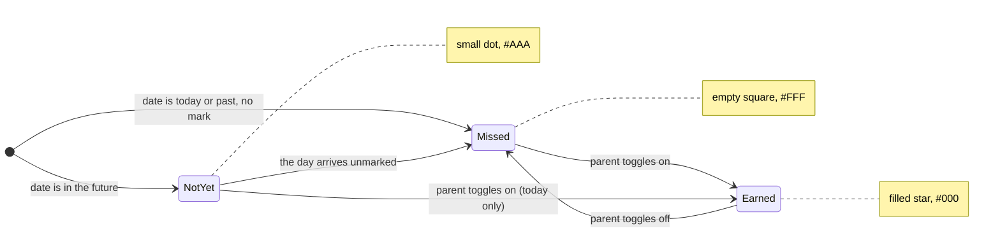
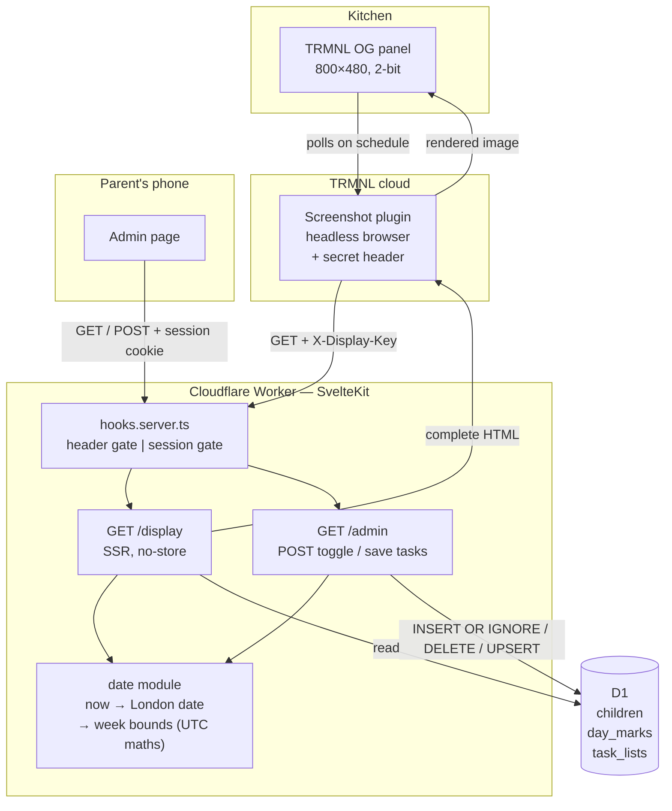

## Context

Greenfield build — see `proposal.md` for motivation. The design is shaped almost entirely by one unusual client: a TRMNL OG e-ink panel that fetches the display page through TRMNL's hosted Screenshot plugin.

That imposes constraints a normal web app does not have:

- **The client is a camera, not a browser.** It loads the page once, screenshots it, and throws it away. Anything that renders after the screenshot fires does not exist.
- **The canvas is fixed and small.** 800×480 physical pixels on a 7.5" panel, so roughly **0.2 mm per pixel**.
- **Four grey levels, no colour.** 2-bit greyscale.
- **Latency is invisible but timeouts are fatal.** Refresh happens on TRMNL's schedule, so a change appearing a few minutes late is fine, but a cold start that stalls the screenshot means a blank wall.
- **The device cannot log in.** No interactive auth is possible on that route.

Everything else — two users, three tables, a few hundred rows a year — is trivially small.

See `specs/` for the behaviour being implemented.

## Goals / Non-Goals

**Goals:**

- A display page that is correct the instant its HTML finishes loading, with zero client-side dependency.
- Date handling that is provably correct across British Summer Time transitions and around midnight.
- An admin page that works from a phone with one thumb, standing in the kitchen.
- Small enough to still be maintainable after a year of not touching it.

**Non-Goals:**

- Sub-minute freshness on the display. TRMNL's polling interval sets the floor and that is fine.
- Any shared UI framework or component library between the two pages. They have almost nothing in common and forcing reuse would compromise the display page.
- Offline support, real-time updates, or multi-household support.

## Decisions

### D1. Absence is the "not earned" state

`day_marks` stores one row per earned day. There is no boolean column and no row for a day that was not earned.

```sql
CREATE TABLE children (
  id         TEXT PRIMARY KEY,
  name       TEXT NOT NULL,
  sort_order INTEGER NOT NULL
);

CREATE TABLE day_marks (
  child_id TEXT NOT NULL REFERENCES children(id),
  date     TEXT NOT NULL,          -- 'YYYY-MM-DD', always a London calendar date
  PRIMARY KEY (child_id, date)
);

CREATE TABLE task_lists (
  child_id   TEXT PRIMARY KEY REFERENCES children(id),
  body       TEXT NOT NULL DEFAULT '',
  updated_at TEXT NOT NULL
);
```

*Why:* it makes "marking is idempotent" and "clearing leaves no residue" fall out of `INSERT OR IGNORE` and `DELETE`, with no update path and no tri-state to reason about. Trophy status is then a `COUNT(*) = 7` over a week's dates.

*Alternative considered:* a `earned BOOLEAN` column. Rejected — it introduces a third state (row exists, earned = false) that means nothing to this system and would need to be handled everywhere.

*Alternative considered:* storing trophies as their own records. Rejected — the spec requires that editing a day mark immediately changes trophy status, so deriving it is both simpler and correct by construction.

### D2. Only "what is today" is timezone-aware; all other date maths is DST-free

The one place `Europe/London` matters is turning *now* into a calendar date:

```
Intl.DateTimeFormat('en-CA', { timeZone: 'Europe/London' }).format(new Date())
  → '2026-08-01'
```

From that point on, dates are plain `YYYY-MM-DD` strings. Week boundaries and day offsets are computed by parsing them into `Date.UTC(...)` and adding multiples of 86,400,000 ms — arithmetic in UTC, which has no DST, so "seven days after Monday" is always exactly seven days.

*Why:* the classic failure here is doing date arithmetic in a timezone that has clock changes and silently getting a 23-hour or 25-hour day. Confining the timezone to a single conversion at the edge eliminates the class of bug entirely.

*Risk:* this relies on Workers having full ICU data for named timezones. Verify early (see Risks).

### D3. Server-rendered with SvelteKit form actions; JavaScript is an enhancement

Both routes are server-rendered. Admin mutations are SvelteKit **form actions**, so toggling a square is a real form POST that works with JavaScript disabled. `use:enhance` layers on optimistic toggling so it feels instant on a phone, reverting the square and surfacing an error if the POST fails.

*Why:* the display page has a hard requirement to be complete at load, which rules out client-side data fetching. Using the same server-first shape on admin means one mental model, and the failure-visibility requirement is satisfied by the framework rather than by hand-rolled state.

*Alternative considered:* a JSON API with client-side rendering on admin. Rejected — more moving parts for two users and one screen, and it would make the two pages diverge structurally for no benefit.

### D4. Two independent gates in `hooks.server.ts`

| Route | Gate | Mechanism |
|---|---|---|
| `/display` | Secret HTTP header | Constant-time compare against a configured secret |
| `/admin/*` | Shared password | Signed, `HttpOnly` + `Secure` + `SameSite=Lax` cookie, long expiry |

The gates do not overlap: an authenticated parent hitting `/display` without the header is rejected, and the header does not grant admin. Both secrets come from Worker environment bindings and the app fails closed if either is absent.

*Why signed rather than random-token-in-a-table:* no session table to store, expire, or clean up. The cookie carries an issued-at timestamp and an HMAC over it; verification is a signature check plus an expiry comparison.

*Alternative considered:* Cloudflare Access in front of `/admin`. Genuinely tempting given Cloudflare is already in use, and it would remove password handling entirely. Rejected for now because it adds an identity-provider dependency to a two-person family app, but it is the obvious upgrade path if the shared password becomes annoying.

### D5. Everything on the display page is inline and self-hosted

The star and trophy are inline SVG. The typeface is a bundled `woff2` served by the app itself. No external requests of any kind.

*Why:* the Screenshot plugin captures whatever is on screen when it fires. Any resource fetched from a third party is a race the screenshot can lose, and losing it means a fallback font or a missing glyph on the kitchen wall until the next refresh.

The display response also sets `Cache-Control: no-store`, so TRMNL never screenshots a cached copy of yesterday's chart.

### D6. Fixed 800×480 layout, expressed in absolute pixels

The display page is not responsive. It is a fixed 800×480 canvas, because it has exactly one viewer.

```
┌ 800 px ──────────────────────────────────────────────────────────────┐
│ 16px padding                                                         │
│  ┌ 376 px ──────────────────┐  ┌ 376 px ──────────────────┐          │
│  │ ALICE                    │  │ BEN                      │          │  task
│  │ • Piano 15 mins daily    │  │ • Piano 10 mins daily    │          │  blocks
│  │ • Reading log signed     │  │ • Spellings              │          │  ~180px
│  │ • Bins out Tuesday       │  │ • Tidy room              │          │
│  └──────────────────────────┘  └──────────────────────────┘          │
│  ──────────────────────────────────────────────────────────────────  │
│                                                                      │
│        LAST WEEK                      THIS WEEK                      │  20px
│        M  T  W  T  F  S  S            M  T  W  T  F  S  S            │  22px
│  ┌────┬──┬──┬──┬──┬──┬──┬──┬──┐ ┌──┬──┬──┬──┬──┬──┬──┬──┐            │
│  │Alice│★│★ │★ │  │★ │★ │★ │🏆│ │★ │★ │★ │· │· │· │· │  │            │  72px
│  ├────┼──┼──┼──┼──┼──┼──┼──┼──┤ ├──┼──┼──┼──┼──┼──┼──┼──┤            │
│  │Ben │★ │  │★ │★ │★ │  │★ │  │ │★ │★ │  │· │· │· │· │  │            │  72px
│  └────┴──┴──┴──┴──┴──┴──┴──┴──┘ └──┴──┴──┴──┴──┴──┴──┴──┘            │
│   80px  └── 7 × 42px ──┘  32px       └── 7 × 42px ──┘  32px          │
└──────────────────────────────────────────────────────────────────────┘
   total grid width: 80 + 294 + 32 + 20 + 294 + 32 = 752 px
   total height used: ~370 px of 480 — slack goes to the task blocks
```

Vertical budget out of 480 px:

| Band | Height |
|---|---|
| Padding (top + bottom) | 24 |
| Task blocks | 180 (grows into the slack) |
| Rule + spacing | 14 |
| Week labels | 20 |
| Weekday letters | 22 |
| Two child rows | 144 |
| **Slack** | **~76** |

*Why absolute pixels:* a fluid layout on a fixed single-viewport target only introduces ways for the chart to be subtly wrong. Hard numbers mean the layout can be verified against the real panel once and then trusted.

### D7. Square states map to specific grey levels



| Element | Level | Hex |
|---|---|---|
| Stickers, names, task text | black | `#000000` |
| Weekday letters, week labels, trophy | dark grey | `#555555` |
| Grid lines, future-day dots | light grey | `#AAAAAA` |
| Background, missed squares | white | `#FFFFFF` |

Sticking to values near the panel's four actual levels keeps the device's own quantisation from dithering solid areas into texture.

## Data flow



The loop closes only on TRMNL's polling interval: a parent toggles a square, D1 changes immediately, and the wall catches up at the next refresh.

## Admin layout

Same grid, different job — every square is a submit button, sized for a thumb.

```
  ┌─ phone width ───────────────────────────┐
  │  CHORE SCORE                    [ tasks ]│
  │                                          │
  │  ALICE                                   │
  │  last week    M  T  W  T  F  S  S        │
  │              [★][★][★][ ][★][★][★]       │
  │  this week    M  T  W  T  F  S  S        │
  │              [★][★][★][ ][·][·][·]       │
  │                          ↑   └── disabled (future)
  │                          today           │
  │  ──────────────────────────────────────  │
  │  BEN                                     │
  │  last week   [★][ ][★][★][★][ ][★]       │
  │  this week   [★][★][ ][·][·][·][·]       │
  └──────────────────────────────────────────┘
```

The two weeks stack rather than sitting side by side, because 14 touch targets across a phone would be too small. Future squares are rendered `disabled`, which enforces the "future days cannot be marked" requirement in the UI; the server re-checks it anyway.

## Risks / Trade-offs

**Squares are physically small.** → At 0.2 mm/px, a 42 px cell is about **8.6 mm** and a star about **6.5 mm**. That reads comfortably at arm's length and from a metre or two, but two weeks on a 7.5" panel is inherently a walk-up-to-it chart, not a read-from-the-doorway one. Mitigation: verify on the real panel before finishing the layout. If it disappoints, the fallback is dropping to a single week, which roughly doubles every dimension — but that loses the "look how good last week was" effect, which is much of the point.

**Workers may lack full ICU data for named timezones.** → If `Intl.DateTimeFormat` with `timeZone: 'Europe/London'` is unavailable or wrong, every date in the system shifts. Mitigation: prove this in the very first task with a test that pins a known BST instant, before any UI is built. Fallback is a small hand-rolled BST rule (last Sunday in March to last Sunday in October), which is a dozen lines and has been stable for decades.

**The Screenshot plugin's custom-header support is a hard dependency.** → If headers turn out not to be available on the plan in use, `/display` has no gate. Mitigation: fall back to an unguessable path segment (`/d/<random>`) which is weaker but adequate given the data is a children's chore chart.

**The screenshot could fire before layout settles.** → Mitigation is structural: no client-side rendering, no external assets, fixed pixel layout, bundled fonts. There is nothing left to settle.

**7/7 is unforgiving, particularly for the 6-year-old.** → A single missed Tuesday kills the week with five days still to run, which removes the incentive for the rest of it. This is a deliberate product decision, not an oversight. Mitigation if it proves demotivating: the rule lives in one derived query, so relaxing it to 6/7 or adding a second tier is a small, contained change.

**A grim-looking wall.** → Mitigated by rendering misses as blank white rather than crosses, so a bad week reads as sparse rather than as a public telling-off.

**Shared password is weak by design.** → Anyone with the password has full write access and there is no audit trail of who changed what. Accepted: the blast radius is two children's sticker records. Cloudflare Access is the upgrade path if that ever stops being true.

## Migration Plan

Greenfield, so this is an initial rollout rather than a migration.

1. Create the D1 database and apply the schema; seed the two `children` rows.
2. Set Worker secrets for the admin password hash and the display header value. Confirm the app fails closed with either absent.
3. Deploy to a Workers preview URL. Verify `/display` renders correctly at exactly 800×480 in a headless browser.
4. Point the TRMNL Screenshot plugin at the preview URL with the custom header and confirm a real capture on the physical panel — this is the step that validates the pixel sizes.
5. Promote to the production URL and set TRMNL's refresh interval.

**Rollback:** revert the Worker deployment. D1 is unaffected by a rollback, and the only stateful risk is the schema, which is created once and not altered by this change. If the panel shows nothing, the wall falls back to what it was before: a piece of paper.

## Open Questions

- **Which typeface.** Needs to be heavy enough to survive 2-bit conversion at small sizes. Decidable when the layout is checked against the real panel; it does not affect structure.
- **TRMNL refresh interval.** A trade-off between how quickly a sticker appears and battery life. Purely a runtime setting, changeable at any time.
- **Whether admin needs login rate limiting.** Probably unnecessary behind an unguessable URL for two users, but trivial to add later via Cloudflare's own tooling if wanted.
