## Context

See `proposal.md` for motivation and `specs/` for the behaviour being implemented.

The constraint that shapes every decision below is already written down: `/display` is loaded by a headless browser that screenshots it onto a panel which cannot report a fault. The archived `add-chore-chart` design listed "real-time updates" among its non-goals, and the reasoning it gave applied to that route specifically. This change does not overturn it there — `/display` comes out of this byte-identical, and the chart-display delta hardens the rule that made it so. What changes is that a second, parent-only route now exists where live behaviour is safe.

Two further pieces of existing structure do most of the work here:

- **`gateFor()` already routes `/admin/*` to the session gate.** A route placed under `/admin` is protected with no change to `hooks.server.ts`, and is unreachable with the display secret by construction rather than by a rule.
- **The admin page's `use:enhance` handlers already `await update()`** before clearing optimistic state. That is an existing seam at exactly the point where the write is known to have landed.

Numbering continues the archived design's series, which ended at D15, because code comments in this repository cite decisions as "design.md D9" and a second series starting at D1 would make those citations ambiguous.

## Goals / Non-Goals

**Goals:**

- Zero change to what `/display` serves. The extraction is a refactor, and the existing display e2e suite passing unmodified is the proof.
- The preview cannot drift from the panel, structurally rather than by discipline.
- No new server-side state, no new dependency, no new secret, no schema change.

**Non-Goals:**

- Any mechanism that would work across devices. See D21.
- Sub-second freshness as a hard requirement. The channel is fast because it is local, not because anything guarantees it.
- Reuse between the admin page's own chrome and the panel canvas. The archived design's rejection of a shared UI layer between the two surfaces still stands; the sharing here is of the canvas itself, in one direction only.

## Data flow

```mermaid
flowchart TD
    subgraph browser["one desktop browser"]
        subgraph tab1["tab 1 — /admin"]
            A1[parent toggles a day<br/>or saves name and tasks]
            A2["use:enhance handler"]
            A3["postMessage&#40;&#41; — empty nudge"]
        end
        subgraph tab2["tab 2 — /admin/preview"]
            B1["BroadcastChannel listener"]
            B2["invalidateAll&#40;&#41;"]
            B3["Panel.svelte<br/>800x480, scaled to fit"]
        end
        CH{{"BroadcastChannel<br/>'chore-score'"}}
    end

    subgraph worker["Cloudflare Worker"]
        F["form action<br/>?/toggle, ?/save"]
        L1["/display load"]
        L2["/admin/preview load"]
        V["buildDisplayView&#40;db, now&#41;"]
    end

    DB[("D1")]
    PANEL["TRMNL screenshotter<br/>x-display-key, every 15 min"]

    A1 --> A2 --> F --> DB
    F -- "action result" --> A2
    A2 -- "after await update&#40;&#41;" --> A3
    A3 --> CH --> B1 --> B2 --> L2
    L2 --> V
    L1 --> V
    V --> DB
    L2 -- "view model" --> B3
    PANEL --> L1
    L1 -- "SSR only, no client runtime" --> PANEL

    style PANEL fill:#eee,stroke:#333
    style DB fill:#eee,stroke:#333
    style V fill:#eee,stroke:#333
```

The nudge and the data travel on different paths and never meet. Nothing about the chart crosses the channel.

## Decisions

### D16. The live view is a separate route under `/admin`, not a mode of `/display`

`/admin/preview` renders the panel canvas with the client runtime enabled. `/display` keeps `csr = false` and is otherwise untouched.

_Why:_ three reasons, in order of weight.

1. **The screenshot must not be put at risk.** A capture timed against network idle will not fire cleanly on a page holding a connection, and the resulting failure is silent — the wall keeps its last image and nothing announces the fault. Keeping the live behaviour on a different URL means the panel cannot encounter it even if the mechanism later grows into something that holds a socket.
2. **The gate falls out for free.** `gateFor()` sends `/admin/*` to the session gate, so the display secret — the credential sitting in a third party's plugin configuration and transmitted on every poll — cannot reach the hydrating page. Under `/display/*` it could, and TRMNL is configured by URL, so a misconfiguration would be enough.
3. **`/display/+layout.ts` states the constraint in one place.** A child route overriding `csr` there would turn a plain statement into a qualified one.

_Alternatives considered:_

- **Conditional CSR on `/display`, decided by which credential authenticated.** Attractive because the gate already distinguishes them, but SvelteKit page options are static exports and cannot be resolved per request. Approximating it — always hydrating, then having the client do nothing when a `data.live` flag is false — still ships the bundle to the panel, which is the thing being avoided.
- **`/display/live` as a sibling route.** Loses reasons 2 and 3 above for no gain.

### D17. The channel message carries nothing; the receiver re-reads

`BroadcastChannel` messages are bare notifications. On receipt the preview calls `invalidateAll()`, which re-runs its server load against D1.

_Why:_ it makes divergence between preview and panel impossible rather than merely unlikely. The preview always displays a view model the server produced, through the same code path the display route uses. A payload-carrying message would mean a second way for the chart to be computed — one that could be right today and subtly wrong after the next change to `squareState` or `toBullets`, and wrong in the specific way that matters least visibly and costs most trust.

The round trip to the Worker is the price. For two tabs on a desk it is imperceptible, and it buys the property that the preview is never showing something the server would not send.

_Alternative considered:_ posting the changed day mark or task text and patching the preview's state client-side. Faster and offline-capable, and rejected for the reason above. It would also require the preview to reimplement the view model, which is the one thing this design is most concerned to avoid.

### D18. The canvas and its view model both become shared

Two extractions, and both are load-bearing:

- `$lib/display/Panel.svelte` — the `.panel` element, everything inside it, all of its CSS, and the `fonts.css` import. What stays behind in `src/routes/display/+page.svelte` is the `html`/`body` reset, the `<svelte:head>` title, and the `width=800` viewport meta, all of which are properly route-level.
- A shared view builder taking `(db, now)` and returning what `/display`'s load returns today. Both routes' loads become thin callers.

_Why both:_ sharing only the component would leave two places computing `rows`, `weeks`, bullets and trophies. Sharing only the loader would leave two copies of the canvas markup to keep in step. Either half alone reintroduces the drift the spec forbids.

_Note on the fonts import:_ it moves into `Panel.svelte` so the component carries its own dependency. This is why the admin preview route gains the self-hosted `woff2` faces without doing anything explicit, and it is also the only way the preview's text wrapping can match the panel's.

### D19. The nudge is posted after the write is confirmed, never before

In each `use:enhance` handler, `postMessage()` goes after `await update()` resolves and only when `result.type !== 'failure'`.

_Why:_ posting earlier is a race the preview loses. It would re-read D1 before the row was written and redraw the old state, then never hear about the real one — the failure mode being a preview that is confidently, permanently one edit behind. Gating on success is what makes the spec's "a failed edit does not reach the preview" scenario true rather than aspirational.

`BroadcastChannel` does not deliver a message to the context that posted it, so the admin tab cannot nudge itself into a reload and discard its own drafts.

### D20. The canvas is scaled with a transform, never made responsive

The preview renders `Panel.svelte` at its true 800×480 inside a wrapper applying `transform: scale(...)` with `transform-origin: top left`, in a box sized to the scaled result.

_Why:_ `transform` scales after layout, so text wraps and lists clip at the true 800px width. That is the entire point — a preview that reflowed to the window would answer a question nobody is asking and would be silently wrong about the one thing hardest to judge from the editor. On a desktop the natural scale is 1, and the wrapper exists so a narrow window degrades by shrinking rather than by cropping.

_Alternatives considered:_

- **An `iframe` pointed at `/display`.** Genuinely isolating, and it would reuse the route rather than the component. Rejected: it needs the display key or a cookie the frame will send anyway, `invalidateAll()` cannot reach inside it, and it puts a second full page load behind every nudge.
- **A responsive canvas.** Rejected by the archived D6 already, for the panel; here it would also destroy the clipping fidelity that makes the preview worth having.

### D21. Reach is deliberately one browser

`BroadcastChannel` is same-origin and same-browser. No polling fallback is added.

_Why:_ the stated need is two tabs on one desktop. Cross-device means either a poll — which spends a D1 read every few seconds, forever, for a case that does not arise — or a Durable Object broadcast hub, which is a lot of moving parts for a two-parent household. Neither earns its keep, and the spec states the limit plainly so nobody later reads the absence as a bug.

If it is ever wanted, this design does not obstruct it: the receiver already re-reads on a bare signal, so a poll or a socket would replace the signal source and nothing else.

### D22. The preview's render stamp is left alone

The stamp shows when the preview last read the data, so an idle tab shows an increasingly old time.

_Why:_ it is accurate — that *is* when the chart was produced. The stamp exists because the panel cannot report a fault, and a parent looking at a live browser tab is not in that position. Suppressing it would make the preview stop being the same canvas, which D18 exists to guarantee, and refreshing it on a timer would reintroduce the periodic work this design has otherwise kept out.

Accepted with it: a preview left open across midnight has stale day squares until something nudges it. The same trade was made on the admin page, which handles it with `refreshIfStale` on `visibilitychange` and `pageshow`. Wiring the preview into that pattern is not part of this change; if the stale-square case turns out to bite, it is a small follow-up and not a redesign.

## What the desk found

Recorded here alongside the reasoning above rather than replacing it, the way the archived change recorded what the panel overturned.

- **D18 held, measurably.** With both tabs open and an edit saved in one, the preview's `.panel` and a fresh capture of `/display` are the **same PNG, byte for byte** — same task text, same bold and italic runs, same grid, same stamp. Nothing about the shared canvas needed adjusting for the preview's sake.
- **D20 gained a border it did not ask for.** The canvas is white on a white page, so at scale 1 the chart had no visible extent — the preview looked like a page of content rather than like a picture of a panel. A 1px `#ddd` outline on the scaling wrapper fixes it. It is on the wrapper, never on `Panel.svelte`, because the panel must not grow a frame the wall would then have to draw.
- **D19's ordering is load-bearing and was checked, not assumed.** Both cross-tab e2e tests were run against a deliberately broken `notifyLive()` and both fail without the nudge. A test that passes either way would have been worse than no test, given what it is standing in for.
- **The task numbering moved once.** Task 5.2 asks for a *server* test of the view builder; it is in the **`workers`** lane instead, because the builder reads D1 and resolves the London date through `londonParts`, and CLAUDE.md requires real workerd for both (design.md D9). A node test would have full ICU and no D1 and so could not see either of the two things most likely to be wrong in production.

Nothing here overturned a decision. D16–D22 stand as written.

## Risks / Trade-offs

- **The extraction touches the one page that must not regress** → `e2e/display.e2e.ts` passes unchanged, not adjusted to accommodate the refactor. If a display e2e test needs editing, the extraction changed behaviour and is wrong.
- **A preview that quietly stops following looks like a working preview** → the failure is visible on the next edit, in front of a parent who is by definition looking at both tabs. Unlike the panel, this surface can be seen to be wrong. Accepted without a heartbeat.
- **`BroadcastChannel` does not exist during SSR** and the preview page is server-rendered before it hydrates → construct it only inside a browser-only effect, with cleanup on teardown, never at module scope.
- **The admin page grows a foot-of-page link that is easy to mislabel** → the spec requires the words "static" and "live" specifically, because "preview" and "preview" tells a parent nothing.
- **Font loading on a route that did not have it** → the preview pulls the display's `woff2` faces. This is a cost on the preview route only, and it is required for the wrapping fidelity in D20, not incidental to it.
- **Two loads now depend on one view builder** → a mistake there breaks the wall chart, not just the preview. Mitigated by the builder being a pure move with no behaviour change, covered by the existing display tests.
