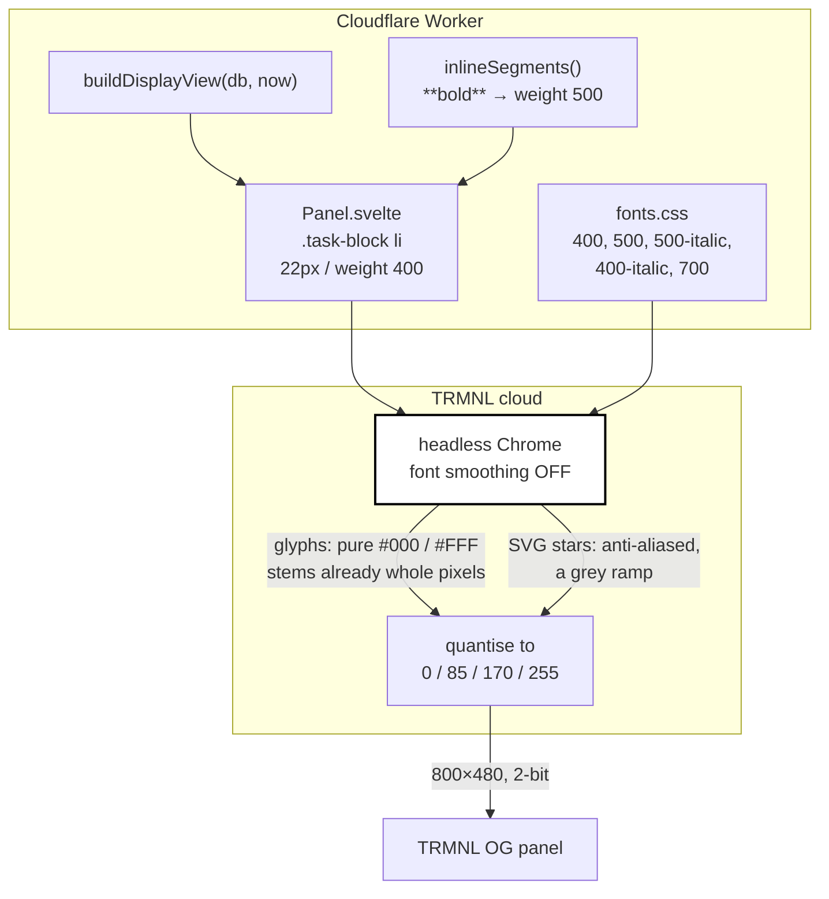

## Context

See `proposal.md` for motivation. What matters here is the measurement, because it overturns something the source tree currently asserts.

Two captures were analysed pixel by pixel: a production render of the real chart, and a deliberate test card deployed to the physical panel showing eight size/weight combinations at once. Both came back at exactly 800×480 with exactly four grey levels — `0, 85, 170, 255` — so the panel is 2-bit as D7 assumed, and nothing in the pipeline is resampling.

The surprise was where those four levels appear:

| Region of the production capture | black | grey 85 | grey 170 | intermediate |
| -------------------------------- | ----- | ------- | -------- | ------------ |
| Task bullet text                 | 10755 | 0       | 0        | **0%**       |
| Bold name headings               | 1245  | 0       | 0        | **0%**       |
| Stars and trophy (inline SVG)    | 4556  | 716     | 5178     | 56%          |

Out of roughly 12,000 ink pixels of text, not one landed on an intermediate level. That cannot happen by quantising anti-aliased text — nearest-level mapping of a grey ramp would leave hundreds. It happens only if the glyphs were rasterised 1-bit in the first place. The SVG shapes on the same image are anti-aliased, because SVG path rendering does not go through the font smoothing path.

## Goals / Non-Goals

**Goals:**

- Task bullets that read from across a kitchen, on a panel whose white is closer to light grey than to white.
- A rule for choosing type on this surface that is stated in terms of what actually governs it, so the next person does not re-derive it from a bad capture.
- Keep the emphasis grammar (D12) working.

**Non-Goals:**

- Changing anything outside the task bullets. The 24px/700 headings measured 3–4px stems and read cleanly; the small grey elements were judged acceptable on the wall. Both are left alone.
- Fixing the rasterisation itself. Whether the capturing browser could be made to anti-alias text is not ours to decide — it is a third party's headless Chrome, and a design that depends on changing it is a design that can be broken without notice.
- Reflowing the grid to defend the eighth bullet line. See D28.

## Decisions

### D25. Text on this panel is rasterised 1-bit, so legibility is a stem-width question, not a colour question

The spec's existing rule — restrict the page to the four grey levels the panel reproduces — is correct for shapes and inapplicable to text. A fill colour is chosen by the author. The greys inside a glyph are generated by the rasteriser from the outline, and on this pipeline they are not generated at all.

```
   what the CSS says          what the capture contains
   ─────────────────          ─────────────────────────
   color: #000000        →    #000 and #FFF, nothing between
   font-size: 20px            every edge hard, every curve a staircase
```

So the question that decides whether text is legible here is: **does a stem land on a whole number of pixels, consistently, across the letters of a word?** Inter is shipped by `@fontsource` unhinted, which means nothing snaps stems to the grid — a stem whose true width is 1.5px rounds up or down according to where it falls, and the same stroke comes out 1px on one letter and 2px on the next.

Measured on the test card, body text only, sampling the fixed-position run `Remember the F# —` so that no emphasis contaminates the figures:

| Setting | 1px stems | 2px | 3px | Reading |
| ------- | --------- | --- | --- | ------- |
| 20px/400 (current) | **19%** | 62% | 8% | the defect |
| 20px/500 | 2% | 66% | 20% | clean |
| 20px/600 | 0% | 34% | 52% | boundary — worst spread |
| 20px/700 | 0% | 3% | 77% | clean |
| **22px/400** | **0%** | **80%** | 6% | **cleanest measured** |
| 22px/500 | 0% | 30% | 60% | boundary |
| 22px/600 | 0% | 13% | 71% | clean |
| 22px/700 | 1% | 0% | 67% | clean |

The single-pixel population is the defect, and 20px/400 is the only setting that has one. That is the whole of the reported problem, stated numerically.

_What this supersedes:_ `src/lib/settings.ts` carries the note "Settled at step 8.4: it survives 2-bit conversion at every size the chart uses, down to the 13px weekday letters, so nothing heavier was needed." That was written looking at the panel and is still true of every size except the one that matters most. It was reached by asking whether the text was readable, which it was, rather than by asking whether it was as readable as the same pixels could make it. The note is corrected rather than deleted, on the same rule the archives already follow.

_Why not fix the hinting instead:_ shipping a hinted build is the textbook answer and would snap stems at every size at once. Rejected as the primary fix because whether FreeType's bytecode interpreter is active in a third party's headless Chrome is not observable from here and not stable if it were. A change whose correctness depends on an unobservable property of someone else's container is a change that fails silently on a surface that cannot report failure (D10). Choosing a size and weight that round well needs nothing from the rasteriser.

### D26. 22px at weight 400, not 20px at weight 500

Two settings in the table are both clean and both preserve emphasis. They differ in what they cost.

| | Stems | Layout cost | New font assets |
| --- | --- | --- | --- |
| **22px/400, bold 500** | 80% at 2px, zero 1px | 8 lines → 7 | `inter-500` + `inter-500-italic` |
| 20px/500, bold 600 | 66% at 2px | none | `inter-500`, `inter-600`, and both italics |

**22px/400 is chosen.** It measured the cleanest stems of anything tested, and the larger letterform is the greater share of the win: at 0.2mm per pixel the chart is read from a metre or two, where size carries further than weight. The photograph of the physical panel also showed that e-ink white is closer to light grey than to white, which costs contrast that thicker strokes recover less well than bigger ones do.

It is also the cheaper of the two in assets. `inter-400-italic` already ships and stays as the face for `*italic*` at body weight, so only one new italic is needed rather than two.

_Why 600 is excluded at 20px, having been the original recommendation:_ it sits on a rounding boundary. Its true stem falls near 2.5px, so it splits 34% at 2px against 52% at 3px — the worst concentration in the table. It trades a 1px/2px flicker for a 2px/3px one. Less severe, because a 2px stroke does not disappear the way a 1px one does, but the same defect. **This was proposed from the desk on a stem-width model and was wrong; only the panel could say so.** The same trap sits at 22px/500, one step up, which confirms the boundary moves with size rather than being a property of the weight.

_Alternative considered:_ 20px/700. Best concentration at its size (77% at 3px) and needs no new upright file. Rejected on D27 — it puts body text at the same weight bold would have to be.

### D27. Emphasis is one weight step above body, and that step is what has to survive rasterisation

`**bold**` moves from a fixed 700 to 500, keeping it one step above the 400 body.

The constraint is not "bold must be bold" but that the two must differ **after** rasterisation. Measured across the same test card, comparing each row's body against its emphasis run:

| Pair | Body modal stem | Emphasis modal stem | |
| ---- | --------------- | ------------------- | --- |
| 400 → 500 | 2px | 3px | distinct |
| 500 → 600 | 2px | 3px | distinct |
| 600 → 700 | 3px | 3px | collapses |

Any body weight at 600 or above puts its emphasis at the same modal stem width as the text it is meant to stand out from. The distribution still shifts, so it does not vanish outright, but the clean separation only exists while body stays at 500 or below. That is the second reason 20px/700 is not viable and the reason this decision and D26 cannot be taken independently.

_Consequence:_ `inter-700-italic.woff2` is retired. It existed to draw `***bold italic***`, which is now 500 italic. The upright `inter-700.woff2` stays — the 24px headings, the week labels and the grid names all use it.

_Why not keep bold at 700 with body at 400:_ tempting, since it needs no new upright file and the contrast would be larger still. Rejected because 400→700 across a 2px body would put emphasis at 3–4px, which at 22px reads as a different typeface rather than as stress — and D12's whole argument for admitting emphasis is that it marks the part of an instruction that matters, not that it shouts.

### D28. The eighth line is spent, not defended

7 × 28px is 196px and fits the existing 200px block; 8 would need 224px. So `BULLETS_MAX` goes 8 → 7 and `BULLETS_COMFORTABLE` 6 → 5.

The budget could be defended instead. Measuring the production capture, the grid rows are 72px tall around 42px cells, and tightening them to 56px frees 32px — enough to keep eight lines at 22px.

**Not taken.** The eight-line budget has never been reached: both children's current lists render in 5 and 6 lines, and the 58px of blank space measured below the last bullet in the production capture is the reservation going unused. Spending a line that is not being used, to avoid touching a grid that is not in the way, is the smaller change — and D6's argument for fixed pixels is that every part of this layout that moves is a way for the chart to be subtly wrong.

The 32px stays documented here as the lever to reach for if the seven-line limit ever actually bites.

_A second cost, easy to miss:_ at 22px a bullet holds roughly 34 characters per line rather than 38, so the change is worth slightly less than one line of capacity, not exactly one. Checked against current production content, which still renders in 5 and 6 lines.

### What the panel found, deployed against real content

D25–D27 were validated against a synthetic test card: one fixed-position sentence, repeated at eight size/weight combinations, deployed on `spike/bullet-weight`. Once shipped to production, a second capture — real bullets, real wraps, one real `**bold**` (Tilly's `**One Man went to Mow**`) — gave a chance to check the numbers against text nobody constructed for the purpose.

**The 1px population dropped as predicted, though not to the test card's zero.**

| | 20px/400 (before) | 22px/400 (after, real content) |
| - | - | - |
| 1px stems | 19% | **4%** |
| modal stem | split 1px/2px | **2px, consistently** |

4% is not the test card's 0%. Real content carries more letterforms and kerning pairs than one sentence at a fixed x-position, so some residual single-pixel population was expected. What matters is the shape of the distribution: 4% against a 71% mode at 2px is occasional, not characteristic — which is the distinction D25 was written to fix, and it held.

**Emphasis separates in the direction predicted, but more softly than the test card suggested.** The test card's isolated body/emphasis pair (D27) measured a clean modal split, 2px against 3px. Real content gives:

| | modal stem | 2px | 3px |
| - | - | - | - |
| all body (400), aggregated across both children | 2px | 71% | 12% |
| `**One Man went to Mow**` (500) | 2px | 47% | 36% |

The bold line shifts real mass from 2px toward 3px — three times the 3px share of body text — but does not flip the mode the way the synthetic pair implied it would. Looking at the photo, the line reads visibly heavier than its neighbours, so it works perceptually. The measurement is recorded as softer than predicted rather than rounded up to "confirmed," because the gap between a synthetic sample and a natural one is itself worth knowing the size of, the next time a decision here leans on a test card built from a single sentence.

_Not retested: the eighth line._ Real content still renders in 5 and 6 lines, so D28's line-budget argument was not exercised by this capture either.

## Data flow



The two arrows out of Chrome are the point. Text reaches the quantiser already 1-bit, so the quantiser does nothing to it and the palette rule never applies; shapes reach it as a ramp and are what that rule governs. Choosing size and weight so the stems are whole pixels **before** the left-hand arrow is the entire mechanism of this change.

## Risks / Trade-offs

**The seven-line limit bites sooner than expected.** → Real content sits at 5 and 6 lines, so there is one line of headroom rather than two, and 22px narrows the column to ~34 characters so more bullets wrap. Mitigation: the admin warning already fires past `BULLETS_COMFORTABLE` and is being lowered to 5, so a parent gets told before the panel clips. The 32px of grid slack in D28 is the escape hatch if that proves too tight.

**The stem model is fitted, not derived.** → The widths in D25 are measured from two captures of one device with one browser. A TRMNL platform change that turns font smoothing on would make the whole basis obsolete — though in the harmless direction, since anti-aliased 22px/400 is not worse than aliased 22px/400. Mitigation: none needed beyond noticing.

**Retiring `inter-700-italic` is a one-way door within this change.** → If D27 is later reversed back to a 700 bold, the file has to come back. It is a `cp` from `node_modules`, and the provenance table in `static/fonts/README.md` records exactly which file. Accepted.

**Nothing in the automated suite can catch a regression here.** → Every test lane renders with anti-aliasing on, so a future change that reintroduces a 1px-stem setting will pass everything and only show up on the wall. Mitigation: the numbers in D25 are recorded here so the next person compares against measurements rather than against a monitor. Deliberately not solved by simulating the panel locally — see Open Questions.

## Migration Plan

No data migration; this is a rendering change.

1. Add the two font files from `node_modules/@fontsource/inter`, update the provenance table.
2. Make the CSS and settings changes, update the unit tests.
3. Deploy, force a panel refresh, and confirm against the real content rather than the test card — the capture that validated this used one synthetic sentence at a fixed position, and real bullets wrap.

**Rollback:** revert the deployment. The only stateful element is `BULLETS_COMFORTABLE`, which changes when a warning appears on the admin page and nothing that is stored.

## Open Questions

- **Whether the small grey elements deserve the same treatment.** The 13px weekday letters and the 14px `#555` render stamp measured 1–2px broken stems in the production capture — worse, proportionally, than the bullets. They were explicitly judged fine on the wall, so they are out of scope. Recorded because the measurement exists and the next person looking at this file will wonder whether it was noticed.
- **Whether a local panel simulation is worth building.** Reproducing the pipeline — render at 800×480, force aliased text, quantise to four levels — would make stem regressions catchable in CI. It was considered and dropped during exploration: the physical panel can be force-refreshed on demand, so the real renderer is minutes away, and an approximation that disagreed with it would be worse than nothing on a surface whose entire epistemology is that the panel decides. Worth revisiting only if forcing a refresh stops being easy.
