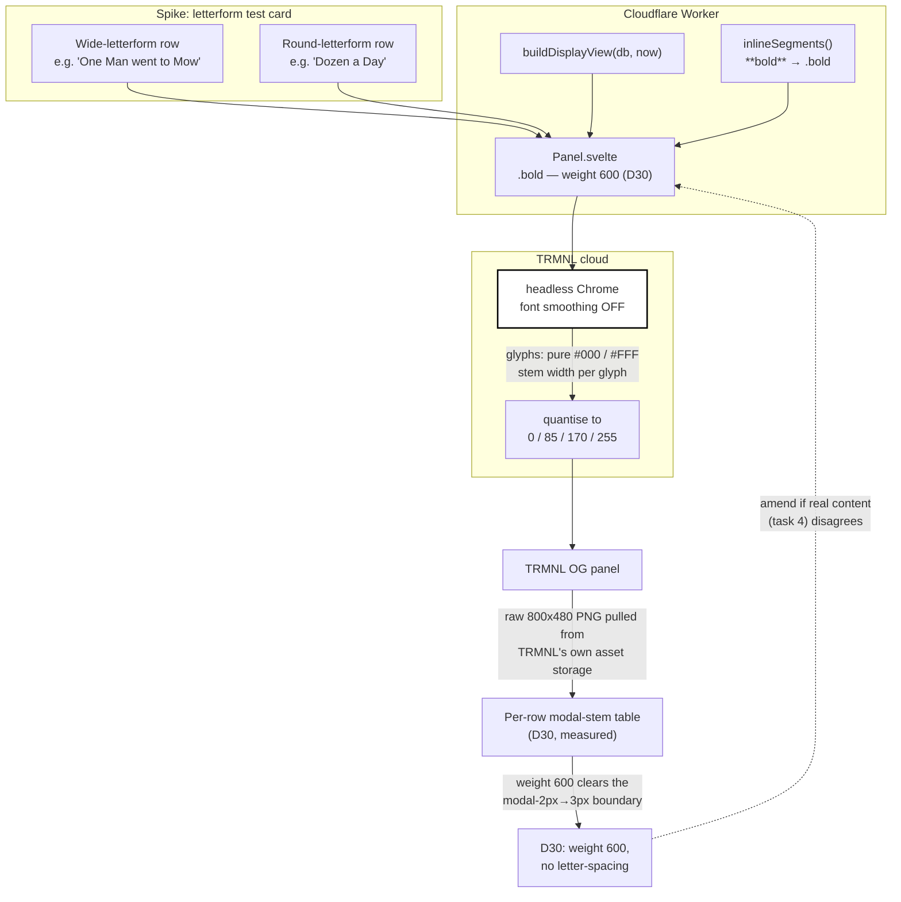

## Context

See `proposal.md` for motivation and evidence. This design continues the decision series in `openspec/changes/archive/2026-08-08-improve-bullet-legibility/design.md` (D25-D28), which established that this panel rasterises text 1-bit with anti-aliasing off, so legibility is a stem-width-after-rounding question rather than a colour or a "does it look different in the source" question. That change picked `.bold` = weight 500 against a synthetic test card, then checked it against one real bullet (`**One Man went to Mow**`) and recorded — but did not act on — a softer-than-predicted separation (47% of body stems at 2px, 36% at 3px, not a clean flip).

A second real bullet, `**Dozen a Day**`, now shows the other side of that same soft boundary: at the identical weight and size, on the identical panel and capture, it renders with no visible weight difference from plain body text at all. D26 already established the operative lesson for this file — a stem-rounding prediction made from a table at a desk was wrong once, and only the physical panel could say so — and this repeats that pattern: the failure mode was knowable in principle from D27's own numbers, but only showed up once real content supplied a bold run made of round letterforms.

## Goals / Non-Goals

**Goals:**

- A `.bold` treatment that reads as emphasis regardless of which letters happen to make up the emphasised run, not just for the specific sentence a test card happened to use.
- Extend, not replace, the D25-D28 measurement method: synthetic test card first to isolate the variable, then a real-content capture to check the prediction survives contact with the panel — because D26's central lesson is that this class of prediction has been wrong before.

**Non-Goals:**

- Reopening body text weight or size (D25/D26). Body's own stem distribution is not in question here; only emphasis's separation from it.
- Reflowing the grid or changing `BULLETS_MAX`/`BULLETS_COMFORTABLE` (D28). Nothing here changes line count or column width.
- Building a local panel simulation. Considered and dropped in the prior change's Open Questions for the same reason it still applies: the physical panel is minutes away via a forced refresh, and an approximation that disagreed with it would be worse than nothing.

## Decisions

### D29. The test card must stress letterform composition, not just repeat the D25 protocol

D25's test card used one fixed-position sentence to isolate size/weight combinations from wrapping and kerning variance. That was the right control for the question it was answering (does *a* weight step survive rasterisation) but the wrong control for this one (does *every* weight step survive rasterisation regardless of which letters are emphasised) — a single sentence cannot expose a per-glyph rounding effect it doesn't happen to trigger.

This change's test card carries at least two emphasis rows built to sit at the extremes already observed in production:

- A wide-letterform row (real example: "One Man went to Mow" — dense in M).
- A round-letterform row (real example: "Dozen a Day" — mostly o, e, a, z).

Each row is measured at every weight candidate under consideration (see D30), the same way D25 swept size/weight combinations, and the modal-stem table is reported per row rather than pooled — pooling is exactly what let the 500-weight choice look sufficient on the first pass, since the wide-letterform row's stronger separation could mask the round-letterform row's absence of one.

### D30. Candidate settings, decided empirically rather than from this document

Two candidates are proposed in `proposal.md`, and this design deliberately does not choose between them yet:

- `.bold` weight 600 instead of 500 (more rounding headroom per D25's standalone 22px/600 numbers, at the cost of a new font weight to fetch).
- Letter-spacing added to `.bold`, which is a whole-pixel layout property rather than a per-glyph rounding outcome, and so should not be sensitive to which letters make up the run — at the cost of being an untested mechanism on this panel at all.

D26 is the reason this document does not pick one now: a prediction about stem rounding, made by reasoning from a table instead of the panel, was wrong once already. Task 3 below runs both candidates through the D29 test card on the physical panel, and this section will be updated with the measured tables and the choice — in the style of D26/D27's own tables and the archived change's "What the panel found" section — once that capture exists. Recording the decision here after measurement, rather than in a follow-up document, keeps this failure mode's full history in one place the way the rest of this series does.

**Measured.** The D29 test card was deployed to `/display` on `spike/bullet-emphasis-weight` and captured two ways: a phone photo of the physical panel, and — new to this change — the raw 800×480 2-bit PNG TRMNL's own pipeline produced, pulled directly from its asset storage. The raw capture is the more trustworthy source: it is the exact bitmap the panel rasterised, with none of a phone photo's uneven lighting or lens softness. Run-length analysis of its horizontal black-pixel spans, pooled per line (the same measure D25's stem tables used):

| | n runs | modal | 2px share | 3px share |
| --- | --- | --- | --- | --- |
| body 400 (reference: "Hands together") | 273 | 2px | 71.1% | 7.7% |
| "One Man went to Mow" at 500 | 398 | **2px** | 45.0% | 34.7% |
| "Dozen a Day" at 500 | 191 | **2px** | 47.1% | 29.8% |
| "One Man went to Mow" at 600 | 393 | **3px** | 18.8% | 55.2% |
| "Dozen a Day" at 600 | 189 | **3px** | 16.9% | 53.4% |

Letter-spacing produced byte-identical run-length distributions to its non-spaced counterpart at the same weight (confirmed for both 500 and 600) — expected, since spacing moves glyphs apart without changing any glyph's own outline, but worth stating plainly: **letter-spacing has no effect on stem width and cannot fix a rasterisation-rounding problem by itself.** It is dropped from further consideration for that reason, not measured further.

**This revises part of the D29 hypothesis.** The theory was that "Dozen a Day"'s round letterforms would round down at a weight where "One Man went to Mow"'s wide letterforms round up — a per-glyph split. The raw-bitmap numbers do not show that split: at weight 500 *both* phrases are modal 2px, statistically close to each other (45.0/34.7 vs 47.1/29.8) and both still short of flipping the mode away from body's own 2px. Neither phrase's emphasis clears the bar at 500; "One Man went to Mow" merely *looked* more convincingly bold in the phone photo, which is a fact about photographing thick strokes versus thin ones under uneven light, not about the source bitmap. At weight 600, both phrases flip cleanly to modal 3px, at almost identical concentration (55.2% vs 53.4%). The failure this change was opened to fix is real and visible on the wall, but the mechanism is simpler than D29 proposed: 500 is just short of the rounding threshold for typical bullet content in general, not specifically for round letterforms, and 600 clears it for both letterform types tested.

**Decision: `.bold` moves to weight 600. No letter-spacing.** It is the smaller change of the two candidates that actually works — no new visual grammar, just enough weight to clear the same rounding boundary D27 already identified, now with headroom on both sides of the letterform spread rather than a boundary sitting inside it. `inter-700-italic` stays retired (D27); `***bold italic***` moves to `inter-600-italic`, already fetched for this spike and kept if this decision holds after the real-content check in task 4.

## Data flow

The loop back into `PANEL` is still live: task 4 checks this decision against real content the way the archived change's "What the panel found" section checked D27, and this section gets amended again if that check disagrees — the dotted arrow stays until that happens. What changed from the plan is the measurement source: rather than a phone photograph of the physical panel, TRMNL's own asset storage turned out to serve the exact raw capture its pipeline produced, giving a clean bitmap to measure instead of one degraded by camera lighting and lens softness. That is also what made the D29 hypothesis revision above visible — a phone photo alone would have shown "One Man went to Mow" reading bold and "Dozen a Day" not, and stopped there.

### What the real-content check found

Deployed weight 600 to production and pulled the raw capture directly from TRMNL's asset storage again, this time of Tilly's actual list rather than the synthetic card. Same run-length method as D30:

| | n runs | modal | 2px share | 3px share |
| --- | --- | --- | --- | --- |
| "11 part 2 (hands together)" (body) | 431 | 2px | 67.5% | 10.4% |
| "12 (hands together)" (body) | 347 | 2px | 73.8% | 7.8% |
| "Hands together" (body) | 273 | 2px | 71.1% | 7.7% |
| **"Dozen a Day" (bold)** | 189 | **3px** | 16.9% | 53.4% |
| **"One Man went to Mow" (bold)** | 393 | **3px** | 18.8% | 55.2% |

**No gap between prediction and reality this time** — the numbers for both bold lines are identical to the spike card's, to one decimal place. That is a departure from D25-D28's own experience, where the real-content check found a softer result than the synthetic test card predicted. The difference is methodological, not a fluke: D25's original card used one sentence invented for the purpose, so its prediction had to generalise to different words. This change's card used the two real phrases verbatim, so there was nothing to generalise — confirming the identical bitmap is largely confirming that production serves what the code says it should, which is still worth doing but is a narrower claim than D25's cross-content prediction was. The three body lines shown above (none of them the phrase used to tune anything) are the closer analogue to that older check, and they land in the same 67-74%-at-2px range body always has, so the boundary is not being crossed by ordinary content either.

## Risks / Trade-offs

**The two-row test card still isn't every possible word.** → D25/D26's own experience is that synthetic cards under-predict real content's softness. Mitigation: same as the prior change — deploy, capture real content (not just the spike), and record the gap between prediction and reality rather than assuming the spike settles it. `**Dozen a Day**` and `**One Man went to Mow**` remain in production regardless, so the real-content check is close to free.

**Letter-spacing is untested on this rendering path at all.** → It is a plausible mechanism (whole-pixel gaps aren't subject to per-glyph rounding) but has no prior measurement on this panel the way weight steps do. Mitigation: measure it with the same rigor as the weight candidate before choosing either — this design treats them as two hypotheses, not a preferred answer with a fallback.

**Nothing in the automated suite catches this class of regression.** → Already true of D25-D28's own risk log: every test lane renders anti-aliased. This change adds no new coverage for that gap; it inherits the prior change's mitigation (numbers recorded here for the next person to compare against, not simulated locally).

## Migration Plan

No data migration; this is a rendering change, same as its predecessor.

1. Build the letterform-stress test card (D29) and deploy it to a spike route or the preview, the way D25's test card was deployed to `spike/bullet-weight`.
2. Capture on the physical panel, measure per-row modal stems for each candidate in D30.
3. Choose the setting (or combination), record the measurement in this file under D30, update `Panel.svelte`/`fonts.css` accordingly.
4. Deploy to production, force a refresh, and capture real content (`**Dozen a Day**` and `**One Man went to Mow**` specifically) to confirm the fix closes the gap this change opened with, not just the spike.
5. Update `Panel.svelte.spec.ts` assertions to the new weight/spacing value.

**Rollback:** revert the deployment. No stateful element changes.
