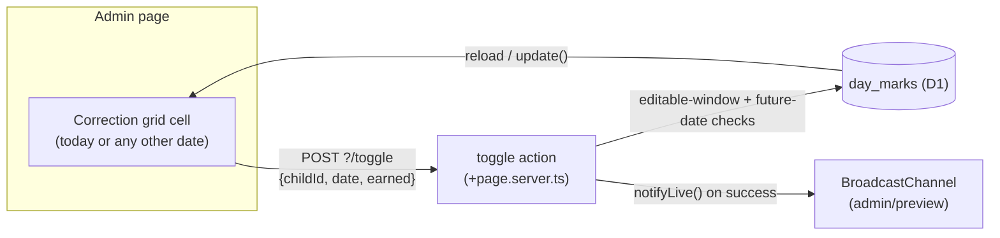

## Context

`src/routes/admin/+page.svelte` currently has two separate places that toggle a day mark for the same child and date, both posting to the same `?/toggle` form action in `+page.server.ts`:

- The `.today` section — two large star cards, one per child, hardcoded to `data.today`.
- The `.corrections` section — a two-week grid of 44×44 controls, one per child per date, with future dates disabled.

Because today is never a future date, today's own cell in the grid is already live and already submits the same date the card would have. The card was additive, not load-bearing: see `design.md D14` in the archived `add-chore-chart` change, which already noted in passing that "the today card was never really 'today'; it was always a control for a specific date, dressed up as today."

`design.md D8` (same archive) is the decision this change reverses: it reasoned that ~95% of admin visits are one parent, in the evening, marking today, and gave that action the top of the page and the largest touch targets on that assumption. That assumption doesn't hold here — the user reports never using the cards, using the grid for today's mark instead.

## Goals / Non-Goals

**Goals:**

- Remove the now-unused today cards and the heading that only made sense when the grid was for corrections alone.
- Leave the day-mark mechanism itself — storage, the toggle action, the editable-window and future-date rules — completely unchanged. Only the UI surface for "mark today" changes; there is one fewer surface, not a different mechanism.

**Non-Goals:**

- No visual highlight for today's column in the grid. Considered and rejected (see Decisions) — the page's `<h1>` date and the "this"/"last" week labels are being judged sufficient to find today's cell.
- No change to `chart-display`, `access-control`, or `chore-tracking`, or to the `/display` route.

## Decisions

### D23. Remove the dedicated today control; the correction grid is the only day-mark surface

Reverses D8's premise. The grid already exercises every rule a today control needs — same toggle action, same optimistic-update handling, same "carries its own rendered date" behavior from D14 — so this is a deletion, not a reimplementation. Nothing new is built.

_Alternative considered:_ keep the cards but make them thinner or fold them into the grid's header row. Rejected — there was no reported friction with the grid itself, only that the cards sat unused above it, so the simplest fix is to remove what isn't used rather than reshape it.

### D24. No visual cue added to today's cell in the grid

The grid does not currently distinguish today's cell from any other non-future cell — only future dates are visually distinct (greyed, disabled). Removing the cards removes the one thing that made "today" visually unambiguous at a glance.

_Considered:_ a border or background highlight on today's column, so "this one" stays obvious without reading the weekday initials against the `<h1>` date.

_Rejected_, by the user's own call: the `<h1>` date plus the "this"/"last" week labels are enough. This is a call worth revisiting if it turns out to be more friction in practice than in discussion — nothing about this change forecloses adding a highlight later.

## Data Flow

Unchanged by this change; included to show that removing the cards removes a UI entry point, not a path through the system.

## Risks / Trade-offs

- **[Risk]** A parent who relied on the cards' visual prominence without realizing it might momentarily lose their bearings. → **Mitigation**: none built in (D24) — the user who requested this change is the only user, and made that call directly. If it becomes friction, D24 names the fallback.
- **[Risk]** `page.svelte.spec.ts`'s "submits the rendered date" test currently asserts specifically against `.today form` and would silently stop testing anything if not updated. → **Mitigation**: `tasks.md` calls this out explicitly as a rewrite, not a deletion, targeting today's cell in the grid instead.
