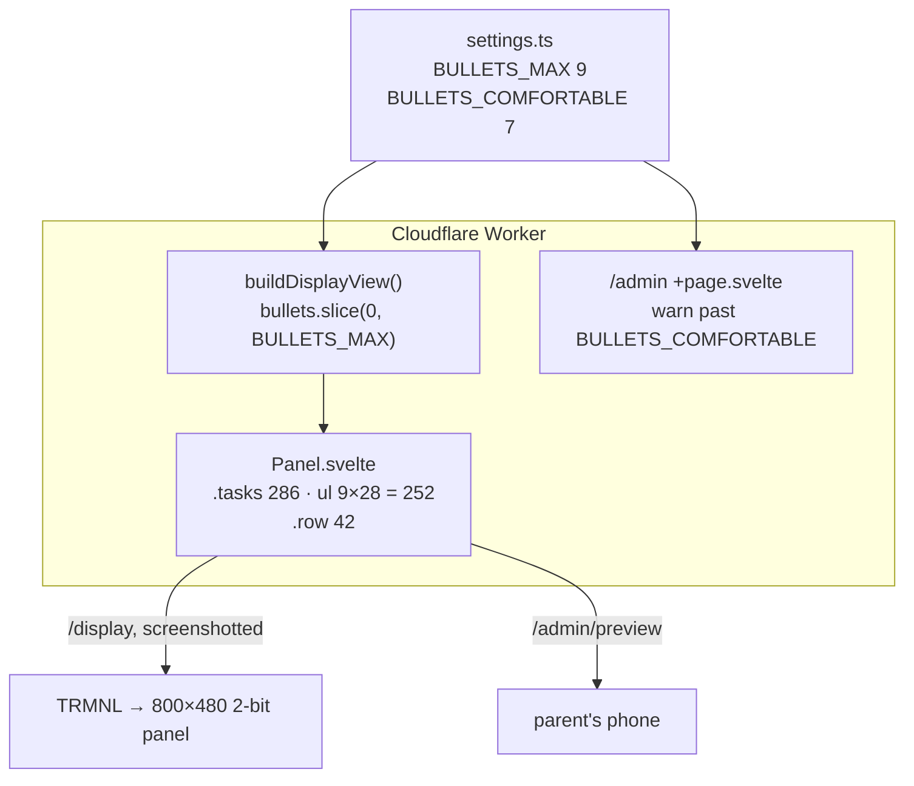

## Context

See `proposal.md` for motivation. The layout is D6's fixed 800×480 canvas, and the type is fixed by D25–D26: 22px/400 on 28px lines, chosen because the panel rasterises text 1-bit and those are the numbers whose stems land cleanly. Shrinking the type to fit more text is not available. **Every extra task line costs exactly 28px of height, and that height has to come from somewhere else on the canvas.**

Where the canvas goes today, top to bottom inside 16px of padding:

```
 y    band                       px
 16   task band                  230   heading 30 + list 7 × 28 = 196 (+4)
 246  rule + margins              15
 261  week labels                 20
 281  weekday letters             22
 303  row, child 1                72   ← 42px cells, 30px of air
 375  row, child 2                72   ← 42px cells, 30px of air
 447  (end of grid)
 456  render stamp (absolute)     16   reserved band, D10
```

The only slack on the canvas is the 60px of air inside the two grid rows. D28 found this, measured it, and chose not to use it because nothing needed the space yet.

## Goals / Non-Goals

**Goals:**

- Two more whole task lines per child without changing type, column width, or anything a child reads.
- The grid ends no lower than it does now, so the stamp's reserved band is untouched.

**Non-Goals:**

- Wider task columns. Width is bounded by the two-children-side-by-side layout (D11). A bullet still holds about 34 characters per line.
- Changing the trophy, the week labels, the weekday letters, or the week order.
- Any change to the admin page beyond the numbers it already reads from `settings.ts`.

## Decisions

### D31. Pull D28's lever: the grid gives up its air to two more task lines

D28 left the 72px rows alone, calling them "the lever to reach for if the seven-line limit ever actually bites." It now bites: the lists have grown past seven lines and are being clipped on the wall. The argument D28 made for leaving the rows alone still stands as reasoning. "Spending a line that is not being used, to avoid touching a grid that is not in the way" was right while lines went unused. What has changed is the premise: the lines are used now.

```
                 before                after
 task band       230  (30 + 7×28)  →   286  (30 + 9×28 + 4)
 rule             15               →    15
 week labels      20               →    20
 weekday letters  22               →    22
 rows           2×72               →  2×42
                 ───                    ───
 grid ends at    447               →   443
```

```
 ┌ 800 ──────────────────────────────────────────────────────────────┐
 │ Tilly                          Ben                                │
 │ Piano: Exercise 11 part 2 -    Spellings list 4                   │
 │ hands together (thumb          Tidy room                          │
 │ crossover)                     Reading log signed                 │  9 lines
 │ ...                            ...                                │  (was 7)
 │                                                                   │
 │ ───────────────────────────────────────────────────────────────── │
 │        14–20 SEP                      LAST WEEK                   │
 │        M  T  W  T  F  S  S            M  T  W  T  F  S  S         │
 │ Tilly ┌──┬──┬──┬──┬──┬──┬──┐       ┌──┬──┬──┬──┬──┬──┬──┐        │
 │       │★ │★ │★ │  │· │· │· │       │★ │★ │★ │★ │★ │★ │★ │ 🏆     │  42
 │ Ben   ├──┼──┼──┼──┼──┼──┼──┤       ├──┼──┼──┼──┼──┼──┼──┤        │
 │       │★ │  │★ │  │· │· │· │       │★ │  │★ │★ │★ │  │★ │        │  42
 │       └──┴──┴──┴──┴──┴──┴──┘       └──┴──┴──┴──┴──┴──┴──┘        │
 │                                           updated Wed 16 Sep 20:14│
 └───────────────────────────────────────────────────────────────────┘
```

The 42px cells, 26px stars and 26px trophy keep their size. The tracker loses empty space, not legibility. The 16px name label and the 26px trophy both centre comfortably in a 42px row.

**Alternatives considered during exploration:**

- **B. Compact grid.** 32px cells, week label and weekday letters merged into one 22px header, 36px rows. That frees about 90px, giving 10 lines (+3). Not taken: it shrinks the stars by about a quarter for one line more than A, and star size on this panel has only ever been verified at 42px cells. It stays as the next lever if nine lines also run out.
- **C. The tracker moves into each child's column.** The name, a strip of this week's squares and a last-week trophy sit at the top of each child's column, with tasks below. That gives about 12 lines (+5). Not taken: it drops last week's squares, turns the adjacent child rows (which the spec says exist so weeks can be compared) into separate columns, and takes away the current week's dated label, which is one of the two staleness signals in D10. It changes what the chart is for, not how its space is divided, and should be proposed on its own terms if it is ever wanted.

### D32. 42px rows: the two children's rows touch and form one table

At 72px rows the two children's cells were separate strips 30px apart. Two nearer heights were considered before settling on the cell height itself:

| Row height | Gap between the two rows' borders | Freed px | Lines |
| ---------- | --------------------------------- | -------- | ----- |
| 46         | 4px of white                      | 52       | 8, because two lines need 56 |
| 44         | 2px of white                      | 56       | 9, exactly |
| **42**     | **none: borders meet**            | **60**   | **9, with 4px clearance** |

- **46** does not free two whole lines. It misses by 4px, so the task band could only grow by 52 and the ninth line would be clipped through the middle, which is the exact failure D6's whole-line rule exists to prevent.
- **44** fits exactly, but leaves two 1px `#AAA` borders separated by 2px of white. On a 2-bit panel that dithers grey, that is a near-miss pattern likely to read as a smudged double line rather than as either a gap or a rule. It is the "hairline" D7's palette rule warns against, just made from two lines instead of one.
- **42** has no near-miss. Each `.cell` already carries its own 1px border, and cells in a row sit flush, so the line between Monday and Tuesday is already two 1px borders touching: a 2px `#AAA` rule. With the rows touching, the line between the two children is built the same way and is the same 2px. The grid becomes one uniform table with the same rule weight in both directions. That is a pattern already on the panel and already verified there.

The 4px left over sits above the stamp band as clearance instead of being given to the list, because 4px is not a line.

### D33. Bullet limits move with the line budget: 9 and 7

`BULLETS_MAX` goes from 7 to 9 and `BULLETS_COMFORTABLE` from 5 to 7. The relationship D6 and D28 set is unchanged: the maximum equals the line budget, which is the ceiling for a list of short bullets, and the comfortable count leaves two lines for bullets that wrap. The server-side clip, the CSS whole-line clip and the admin warning all keep agreeing because they all read the same two constants and the same list height.

## Data flow

Nothing about the flow changes. This is a redistribution of pixels inside `Panel.svelte`, and the diagram shows where the two numbers this change moves are read, so they can't drift apart.



`/admin/preview` renders the same `Panel.svelte` (D18), so the preview picks up the new layout with no separate change, and a parent can check a long list against nine lines before the wall does.

## Risks / Trade-offs

**Touching rows could read as one undivided block on the panel.** → The merged border is the same 2px `#AAA` as the vertical rules, which already survive capture, but no capture has yet shown a 2px horizontal rule separating two rows of stars. Mitigation: panel verification is a task. If the children's rows don't read as separate, the fallback is to separate them without spending a task line: either a 2px white gap (44px rows, using up the 4px clearance, though with D32's doubled-line risk) or 42px rows with the shared border drawn in `#555`. Whichever is taken gets recorded here, together with the capture that decided it.

**Nine lines move the list's bottom edge 56px nearer the grid.** → With the 15px rule and margins unchanged, the separation between instructions and tracker is exactly what it is today. A full list will make the canvas look denser than it did. Accepted: the density is the content the parents asked to show.

**The grid now ends 4px higher, and the stamp band stays where it is.** → The grid's right edge (the last-week trophy column) sits directly above the stamp. The existing e2e tests only check that each stays within 480px, not that they don't overlap. Mitigation: add an overlap check, because this change is the first to move the grid since that band was reserved.

**Nine lines may not be enough either.** → B (D31) is documented as the next step, with its cost stated: smaller stars.

## Migration Plan

No data migration. `BULLETS_COMFORTABLE` only affects when the admin warning appears. Nothing that is stored changes.

1. Change the three heights in `Panel.svelte` and the two constants in `settings.ts`, updating the comments that cite 7 lines, 196px and 72px.
2. Run the unit and e2e suites. The layout tests assert relationships, so they should pass unchanged. Add the grid/stamp overlap test.
3. Check `/admin/preview` against the longest real list.
4. Deploy, force a panel refresh, and check the capture (D32's risk).

**Rollback:** revert the deployment. The panel shows the old layout from its next capture onward, and lists over seven lines go back to being clipped.
